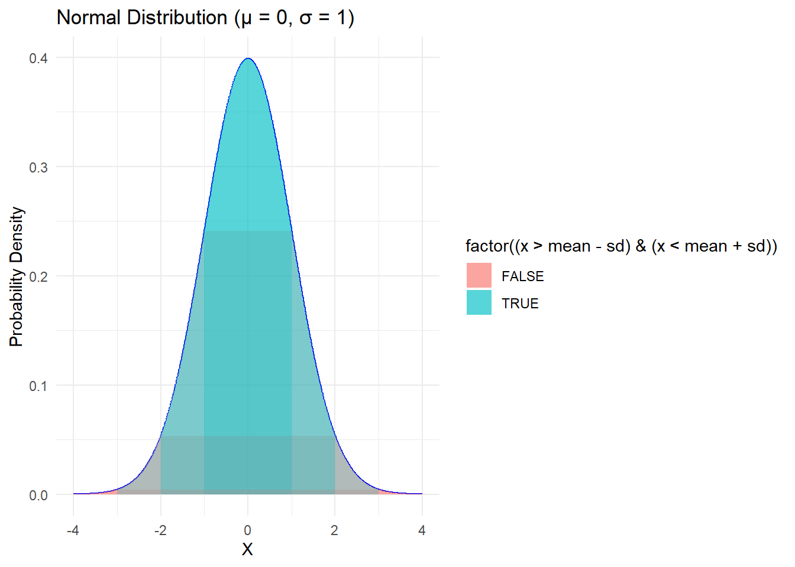

# Normal Distribution

The normal distribution is a fundamental concept in statistics and probability theory. It is a bell-shaped, continuous probability distribution that is symmetrical and fully determined by two parameters: the mean (μ) and the standard deviation (σ). The normal distribution is characterized by the following properties:

- It is continuous and takes on all possible real values.
- It is symmetric around the mean, which is the highest point of the curve.
- It has a bell-shaped curve, with most of the data clustered around the mean and gradually decreasing in frequency as you move away from the mean.
- It is fully specified by its mean and standard deviation, with the 68-95-99.7 rule describing how much of the data falls within one, two, or three standard deviations from the mean.
- It is widely used to model many natural phenomena and measurements in the social and natural sciences.

One of the key properties of the normal distribution is the 68-95-99.7 rule, also known as the empirical rule or the three-sigma rule. According to this rule, approximately 68% of the data falls within one standard deviation of the mean, 95% of the data falls within two standard deviations of the mean, and 99.7% of the data falls within three standard deviations of the mean. This property makes the normal distribution useful for making probabilistic statements about the data.The Normal distribution is a continuous, symmetric, bell-shaped
distribution that is defined by two parameters: the mean (μ) and the
standard deviation (σ).

The mean (μ) determines the center of the distribution, and the standard
deviation (σ) controls the spread or dispersion of the data.
Approximately 68% of the data falls within one standard deviation from
the mean, 95% falls within two standard deviations, and 99.7% falls
within three standard deviations. This is known as the Empirical Rule or
the 68-95-99.7 rule.

The probability density function (PDF) of the Normal distribution is
given by:


Where:

f(x) is the probability density at point x μ is the mean of the
distribution σ is the standard deviation of the distribution e is the
base of the natural logarithm (approximately 2.718) π is the
mathematical constant Pi (approximately 3.141) .

## Unit Normal Distribution

A unit normal distribution is a normal distribution with a mean of 0 and a standard deviation of 1. It is also known as the standard normal distribution or the Z-distribution. The concept of a unit normal distribution is useful because any normal distribution can be transformed into a unit normal distribution through a process called standardization. Standardization involves subtracting the mean from each data point and then dividing by the standard deviation. This transforms the data into a Z-score, which represents the number of standard deviations away from the mean.


```
#> Warning: package 'ggplot2' was built under R version 4.2.3
```



The plot shows thebell-shaped curve of the distribution, illustrating how the data is
symmetric around the mean and decreases as you move away from the center.

The normal distribution relates to the concepts of skewness and kurtosis. Skewness refers to the degree of asymmetry in a distribution, with positive skewness indicating that the distribution is skewed to the right and negative skewness indicating that the distribution is skewed to the left. The normal distribution has a skewness of 0, indicating perfect symmetry. Kurtosis refers to the degree of peakedness in a distribution, with high kurtosis indicating a sharp peak and low kurtosis indicating a flat peak. The normal distribution has a kurtosis of 3, which is known as mesokurtic. Distributions with higher kurtosis are called leptokurtic and those with lower kurtosis are called platykurtic.

# Skewness and Kurtosis

Skewness and Kurtosis are two different measures of shapes and
distribution of a dataset in qualitative methods.

## Skewness

Skewness is a measure of the asymmetry of a distribution. It describes
the degree to which the distribution deviates from a symmetric shape. A
skewness value of 0 indicates a perfectly symmetric distribution.
Positive skewness indicates a distribution with a longer tail on the
right side, while negative skewness indicates a longer tail on the left
side.

## Kurtosis

Kurtosis is a measure of the "tailedness" or "peakedness" of a
distribution. It describes how the distribution's tails and peak compare
to a normal distribution. A kurtosis value of 0 indicates a distribution
with a similar shape to a normal distribution. Positive kurtosis
indicates a distribution with heavier tails and a more peaked shape than
a normal distribution, while negative kurtosis indicates lighter tails
and a less peaked shape.

## Generating Skewness and Kurtosis using R

We can use the same `psych` package to generate skewness and Kurtosis. The `describe()` function also provides other descriptive statistics, such as mean, median, standard deviation, and range. If you only want to see the skewness and kurtosis, you can use the `skew()` and `kurtosis()` functions separately.


