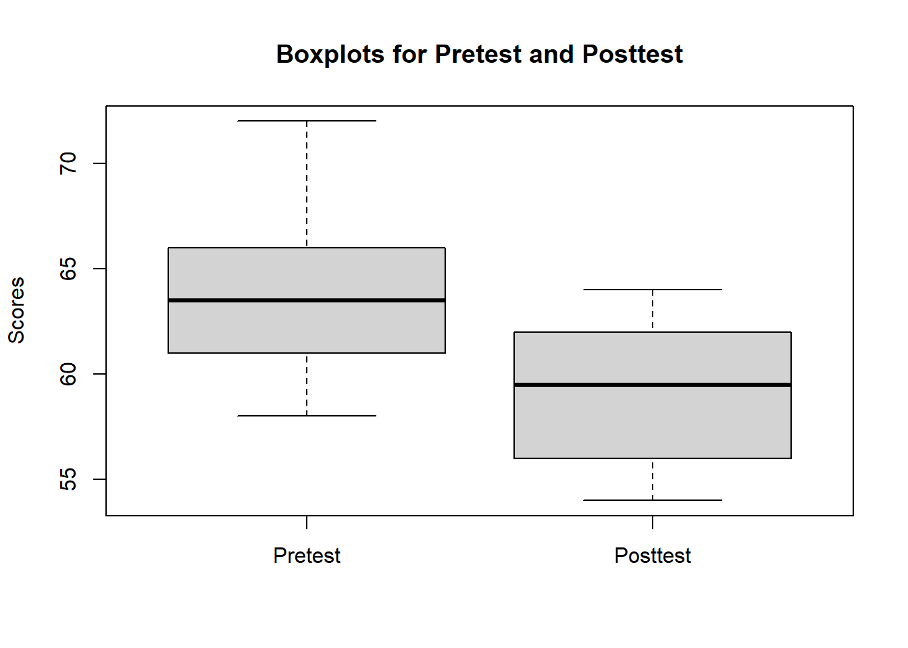

# Paired t-test

The paired samples t-test is used when the observations are collected from the same individuals or matched pairs (e.g., siblings, twins) under different conditions or at different time points. The purpose of the test is to determine if there is a significant difference between the means of the paired differences.

The paired t-test is based on the following null (H₀) and alternative (H₁) hypotheses:

-   H₀: μ_d = 0 (There is no significant difference between the means of the paired differences.)

-   H₁: μ_d ≠ 0 (There is a significant difference between the means of the paired differences.)

Mathematically, the test statistic for the paired t-test (t-value) is calculated using the following formula:

t = (M_d - μ_d) / (s_d / sqrt(n))

where:

-   M_d is the mean of the paired differences

-   μ_d is the population mean difference (0 in the null hypothesis)

-   s_d is the standard deviation of the paired differences

-   n is the number of pairs

-   The t-value follows a t-distribution with degrees of freedom (df) equal to n - 1.

The paired t-test is used when the observations within each pair are related or matched (e.g., pre-test and post-test scores of the same individuals, or scores of matched pairs like siblings or twins).The test compares the means of the paired differences rather than the means of the original observations.

**Examples:**

-   Comparing pre-test and post-test scores of students to determine the effectiveness of a teaching intervention.

-   Comparing the performance of students in two different courses taught by the same instructor.

**Recommendations:**

-   Use the paired t-test when you have dependent samples and are interested in the difference between the means of the paired differences.

-   Ensure the assumptions of the paired t-test are met (see below).

**Sample size:**

-   The sample size should be large enough to provide adequate statistical power to detect a meaningful effect.

-   The required sample size depends on the effect size, significance level, and desired power. It can be calculated using power analysis techniques (e.g., using the **`pwr`** package in R).

**Assumptions:**

1.  **Paired observations**: The observations within each pair should be related or matched, such as pre-test and post-test scores of the same individual, or scores of matched pairs like siblings or twins.

2.  **Random sampling**: The pairs of observations should be obtained through random sampling from the population of interest. This ensures that the sample is representative of the population and the results can be generalized.

3.  **Normality of differences**: The differences between the paired observations should be approximately normally distributed. This assumption can be checked using a variety of methods, such as histograms, Q-Q plots, or statistical tests like the Shapiro-Wilk test.

4.  **Independence of pairs**: The pairs of observations should be independent of each other. In other words, one pair's difference should not influence another pair's difference.

5.  **Interval or ratio scale data**: The data for the paired observations should be measured on an interval or ratio scale. This means that the data should have a meaningful zero point and equal intervals between adjacent values.

    It is essential to ensure that these assumptions are met before conducting a paired t-test, as violation of these assumptions may lead to incorrect inferences. If any of these assumptions are violated, alternative statistical tests or data transformation methods might be more appropriate.

### **Performing the paired t-test using R**

We will need data from two related groups or samples, typically stored in a data frame with two variables representing the paired observations. Then we will be loading the requirec libraries. We will be using pysch package.


```r
swimdata <- read.csv("exampledata/Ch7_swim.csv")
summary(swimdata)
#>     pretest         posttest    
#>  Min.   :58.00   Min.   :54.00  
#>  1st Qu.:61.25   1st Qu.:56.25  
#>  Median :63.50   Median :59.50  
#>  Mean   :64.00   Mean   :59.00  
#>  3rd Qu.:65.75   3rd Qu.:61.75  
#>  Max.   :72.00   Max.   :64.00
```

### Data screening procedures
Before performing the paired t-test, it is essential to check the assumptions mentioned earlier, including the normality of differences and the presence of outliers.

Check for outliers using boxplots:


```r
boxplot(swimdata$pretest, swimdata$posttest, names = c("Pretest", "Posttest"), ylab = "Scores", main = "Boxplots for Pretest and Posttest")
```



Check for the normality of differences using histograms or Q-Q plots:


