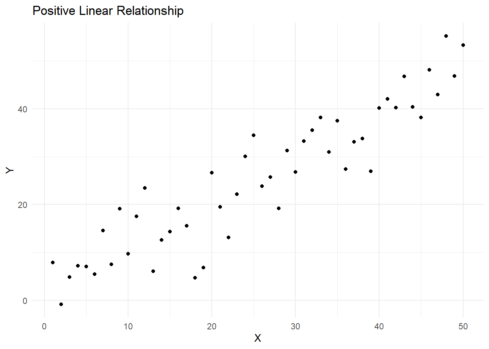
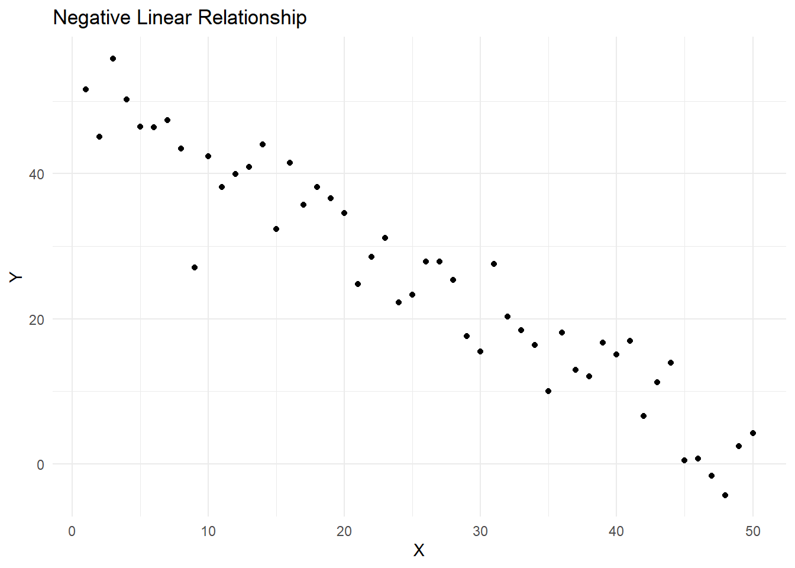
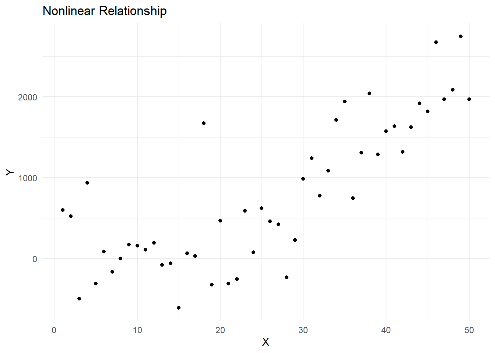
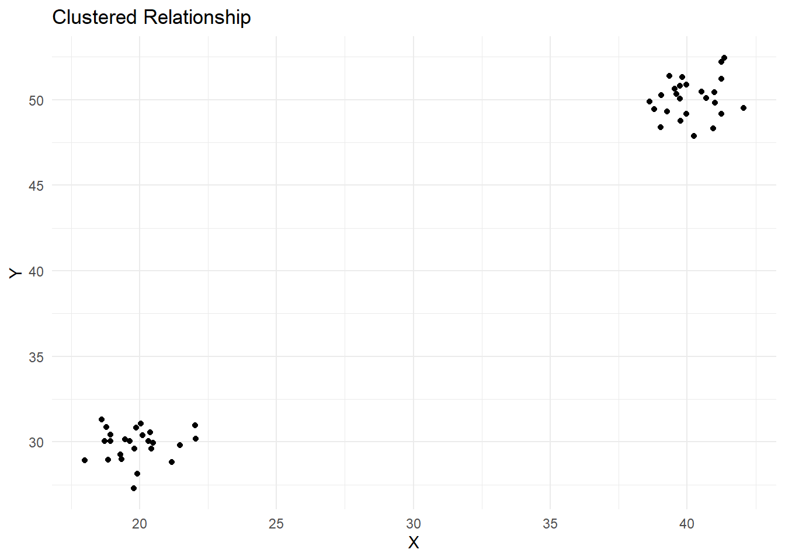
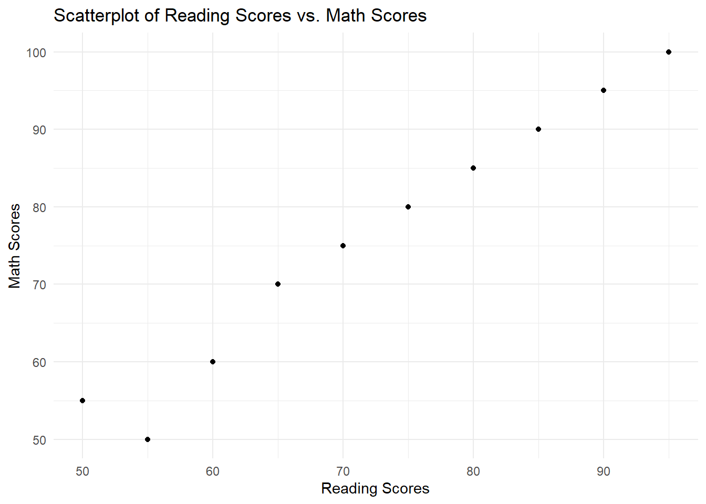

# Scatter Plots

## Bivariate Measures of Association

Bivariate measures of association are statistical methods used to examine the strength, direction, and nature of the relationship between two variables. In educational research, these measures help researchers understand the associations between different factors that may influence educational outcomes, such as student performance, teaching strategies, or resource allocation. By understanding these relationships, researchers can make informed decisions and develop effective interventions to improve educational outcomes.

## Scatterplots

Scatterplots are an important tool in understanding bivariate measures of association. A scatterplot is a graphical representation of the relationship between two variables, where each point on the plot represents a pair of observations from the two variables. The pattern of the points can give us an idea of the direction, strength, and shape of the relationship between the two variables.

For example, in educational research, a scatterplot could be used to visualize the relationship between students' reading scores and their math scores. By examining the scatterplot, researchers can identify whether there is a positive or negative relationship between the two variables, whether the relationship is linear or nonlinear, and how strong the association is.

Here are some key insights that scatterplots can provide:

Direction: The direction of the relationship between the two variables can be positive, negative, or no relationship. In a positive relationship, as one variable increases, the other variable also increases. In a negative relationship, as one variable increases, the other variable decreases. If there is no relationship, the points are scattered randomly, indicating no association between the two variables.

Strength: The strength of the relationship can be determined by how closely the points follow a specific pattern (e.g., a straight line). A strong relationship has points closely following the pattern, while a weak relationship has points scattered more widely around the pattern.

Shape: The shape of the relationship can be linear, nonlinear, or no relationship. A linear relationship follows a straight line, while a nonlinear relationship follows a curve or other non-straight pattern. No relationship means that the points are scattered randomly, indicating no association between the two variables.

As an example, lets create five different types of plots here to see how they differ in terms of these attributes.


```r
# Load ggplot2 package
library(ggplot2)
#> Warning: package 'ggplot2' was built under R version 4.2.3

# Create sample datasets
set.seed(42)

positive_linear <- data.frame(x = 1:50, y = 1:50 + rnorm(50, sd = 5))
negative_linear <- data.frame(x = 1:50, y = 50:1 + rnorm(50, sd = 5))
nonlinear <- data.frame(x = 1:50, y = (1:50)^2 + rnorm(50, sd = 500))
no_relationship <- data.frame(x = 1:50, y = rnorm(50))
clustered <- data.frame(x = c(rnorm(25, mean = 20), rnorm(25, mean = 40)), y = c(rnorm(25, mean = 30), rnorm(25, mean = 50)))

# Function to create scatterplots
create_scatterplot <- function(data, title) {
  ggplot(data, aes(x = x, y = y)) +
    geom_point() +
    xlab("X") +
    ylab("Y") +
    ggtitle(title) +
    theme_minimal()
}

# Generate scatterplots
positive_linear_plot <- create_scatterplot(positive_linear, "Positive Linear Relationship")
negative_linear_plot <- create_scatterplot(negative_linear, "Negative Linear Relationship")
nonlinear_plot <- create_scatterplot(nonlinear, "Nonlinear Relationship")
no_relationship_plot <- create_scatterplot(no_relationship, "No Relationship")
clustered_plot <- create_scatterplot(clustered, "Clustered Relationship")
```

This R code will generate 5 different possible scatterplots, each representing a different type of relationship. Lets display them individually and see how they show the relationship.

#### Positive linear relationship:

The points in the scatterplot show an upward trend, indicating a positive relationship between the variables.


```r
print(positive_linear_plot)
```



#### Negative linear relationship
The points in the scatterplot show a downward trend, indicating a negative relationship between the variables.


```r
print(negative_linear_plot)
```



#### Nonlinear relationship
The points in the scatterplot follow a curve or other non-straight pattern, indicating a nonlinear relationship between the variables.


```r
print(nonlinear_plot)
```



#### No relationship
The points in the scatterplot are scattered randomly, indicating no association between the variables.


```r
print(no_relationship_plot)
```


#### Clustered relationship
The points in the scatterplot form clusters, indicating that the relationship between the variables may be more complex or that there may be other factors at play.


```r
print(clustered_plot)
```



These scatterplots can help you visualize and understand the associations between different variables in your data.

## Generating Scatterplots using R

First, let's install and load the ggplot2 package, and create a sample dataset:


```r
# Load ggplot2 package
library(ggplot2)

# Create a sample dataset
data <- data.frame(
  reading_scores = c(50, 60, 65, 55, 70, 75, 80, 85, 90, 95),
  math_scores = c(55, 60, 70, 50, 75, 80, 85, 90, 95, 100)
)
```

Now, we can create a scatterplot of reading_scores vs. math_scores.


```r
# Create a scatterplot
scatterplot <- ggplot(data, aes(x = reading_scores, y = math_scores)) +
  geom_point() +
  xlab("Reading Scores") +
  ylab("Math Scores") +
  ggtitle("Scatterplot of Reading Scores vs. Math Scores") +
  theme_minimal()

# Display the scatterplot
print(scatterplot)
```



In the example above, we used the ggplot2 package to create a scatterplot. The aes function maps the x and y axes to the reading_scores and math_scores variables, respectively. The geom_point function adds points to the scatterplot, representing the paired observations of reading_scores and math_scores. The xlab, ylab, ggtitle, and theme_minimal functions are used to customize the appearance of the scatterplot.
