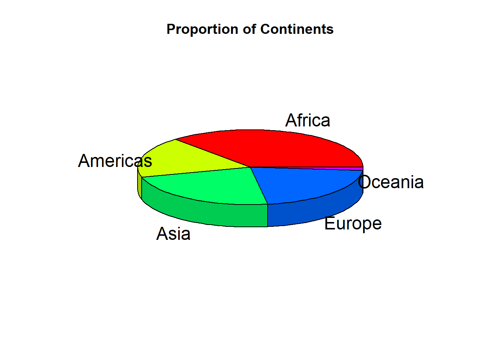

# Data Representation

\## Frequency Tables: A frequency table displays the number of occurrences (frequencies) for each category or value in a data set. It is particularly useful for summarizing categorical data or discrete numerical data.


```r
# Example data
data <- c("A", "A", "B", "A", "B", "C", "C", "A", "B", "C")

# Frequency table
table(data)
#> data
#> A B C 
#> 4 3 3
```

## Histograms:

Histograms are used to visualize the distribution of continuous or discrete numerical data. They display the data using intervals (bins) along the x-axis and the frequency of observations within each bin on the y-axis.


```r
# Example data
data_numeric <- c(1, 2, 3, 4, 5, 6, 7, 8, 9, 10)

# Histogram
hist(data_numeric)
```


## Bar Graphs:

Bar graphs are used for displaying categorical data. Each category is represented by a bar, and the height (or length) of the bar indicates the frequency or count of that category.


```r
#Bar graph
barplot(table(data))
```


## Pie Charts:

Pie charts represent categorical data as slices of a circle. The size of each slice is proportional to the frequency of each category. Pie charts are useful for visualizing relative proportions of categories.


```r
#Pie chart
pie(table(data))
```


## Box Plots:

Box plots are used for visualizing the distribution of continuous or discrete numerical data. They show the median, quartiles, and outliers of the data, providing a compact and informative representation of the data distribution.


```r
boxplot(data_numeric)
```



Each of these data representation techniques serves a different purpose and is suited for different types of data. By understanding when to use each method, you can effectively communicate your data insights and findings.
