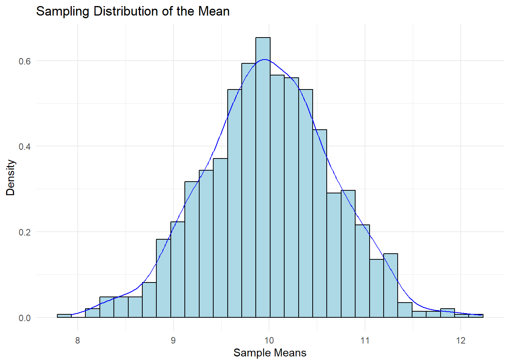

#Sampling distribution

A sampling distribution is the probability distribution of a sample statistic (e.g., sample mean, sample proportion) obtained from a population. It helps to understand the variability of the sample statistic and the likelihood of obtaining different sample statistics from the population.

## Central Limit Theorem

The CLT states that, for a large enough sample size (usually n ≥ 30), the distribution of the sample means approaches a normal distribution, regardless of the shape of the population distribution. The mean of the sampling distribution is equal to the population mean (μ), and the standard deviation (standard error) is equal to the population standard deviation (σ) divided by the square root of the sample size (n).


```r
# Load required libraries
library(ggplot2)

# Set seed for reproducibility
set.seed(123)

# Define population parameters
population_mean <- 10
population_sd <- 5

# Define sample size and number of samples
sample_size <- 50
num_samples <- 1000

# Generate random samples and calculate sample means
sample_means <- replicate(num_samples, mean(rnorm(sample_size, mean = population_mean, sd = population_sd)))

# Plot the distribution of sample means
ggplot(data.frame(sample_means), aes(x = sample_means)) +
  geom_histogram(aes(y = ..density..), bins = 30, fill = "lightblue", color = "black") +
  geom_density(color = "blue") +
  ggtitle("Sampling Distribution of the Mean") +
  xlab("Sample Means") +
  ylab("Density") +
  theme_minimal()
#> Warning: The dot-dot notation (`..density..`) was deprecated in
#> ggplot2 3.4.0.
#> ℹ Please use `after_stat(density)` instead.
```



## Confidence Intervals
Confidence intervals are a range of values within which the true population parameter is likely to fall, with a specified level of confidence (e.g., 95%). Confidence intervals provide an estimate of the precision and uncertainty of the sample statistic.

```r
# Define the sample data
sample_data <- c(12, 15, 18, 20, 22, 24, 25, 28, 30, 32)

# Calculate the sample mean and standard deviation
sample_mean <- mean(sample_data)
sample_sd <- sd(sample_data)

# Calculate the standard error
standard_error <- sample_sd / sqrt(length(sample_data))

# Calculate the 95% confidence interval
alpha <- 0.05
critical_value <- qnorm(1 - alpha / 2)
margin_of_error <- critical_value * standard_error
confidence_interval <- c(sample_mean - margin_of_error, sample_mean + margin_of_error)
```
