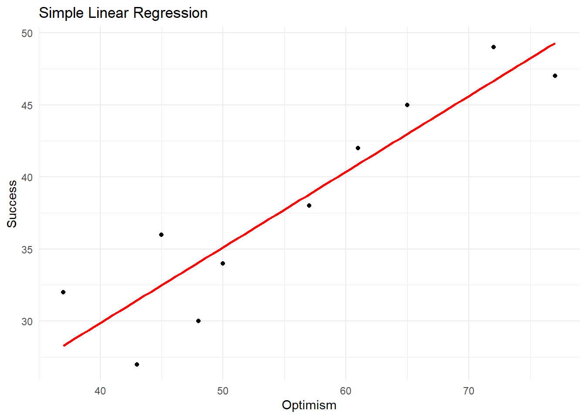

# Simple Linear Regression

Simple linear regression is a statistical method used to model the
relationship between a single independent variable (predictor) and a
dependent variable (outcome). It is a basic technique that can help
researchers understand the association between two continuous variables
and make predictions based on the observed data.

In simple linear regression, we try to find the best-fitting straight
line through the data points on a scatterplot. The line represents the
predicted value of the dependent variable (Y) for a given value of the
independent variable (X). The equation for the line is as follows:

Y = b0 + b1X + ε

Here:

Y is the dependent variable (outcome) X is the independent variable
(predictor) b0 is the intercept, which represents the value of Y when X
is zero b1 is the slope, which represents the change in Y for a one-unit
increase in X ε is the error term, which accounts for the difference
between the actual and predicted values of Y In simple linear
regression, the goal is to find the values of b0 and b1 that minimize
the sum of the squared differences between the observed values of Y and
the predicted values (based on the line). This method is called the
least squares estimation.

To better understand simple linear regression, let's consider a
scatterplot with two variables X and Y:


```r
y
|
|       •
|     •
|   •
| •
+----------------
  x
```

## Regression using R

To perform simple linear regression in R using the psych package, we can
use the following code:


```r
# Load required packages
library(readr)
#> Warning: package 'readr' was built under R version 4.2.2
library(psych)
#> Warning: package 'psych' was built under R version 4.2.3

# Read the CSV file into a data frame
data_file <- "exampledata/Empsuccess.csv"
data <- read_csv(data_file)
#> Rows: 10 Columns: 2
#> ── Column specification ────────────────────────────────────
#> Delimiter: ","
#> dbl (2): Optimism, Success
#> 
#> ℹ Use `spec()` to retrieve the full column specification for this data.
#> ℹ Specify the column types or set `show_col_types = FALSE` to quiet this message.

# Perform simple linear regression
model <- lm(Success ~ Optimism, data = data)

# Display the model summary
summary(model)
#> 
#> Call:
#> lm(formula = Success ~ Optimism, data = data)
#> 
#> Residuals:
#>     Min      1Q  Median      3Q     Max 
#> -4.4380 -1.9932  0.1626  2.2568  3.7118 
#> 
#> Coefficients:
#>             Estimate Std. Error t value Pr(>|t|)    
#> (Intercept)  8.86473    4.56965   1.940 0.088358 .  
#> Optimism     0.52496    0.08034   6.535 0.000181 ***
#> ---
#> Signif. codes:  
#> 0 '***' 0.001 '**' 0.01 '*' 0.05 '.' 0.1 ' ' 1
#> 
#> Residual standard error: 3.165 on 8 degrees of freedom
#> Multiple R-squared:  0.8422,	Adjusted R-squared:  0.8225 
#> F-statistic:  42.7 on 1 and 8 DF,  p-value: 0.0001814
```

The output is the summary of a simple linear regression model fitted to
the data, where Success is the dependent variable (outcome), and represents the score on the employment success scale. 
Optimism is the independent variable (predictor),represents the scores on the work optimism scale. 

Let's break it down piece by piece:

**Residuals**: Residuals are the differences between the observed and
predicted values of the dependent variable. The summary provides the
minimum, 1st quartile, median, 3rd quartile, and maximum residuals. This
information helps us understand the spread of the residuals, which
should ideally be evenly distributed and close to zero.

**Coefficients**: The coefficients table provides the estimates,
standard errors, t-values, and p-values for the intercept and predictor
variable (Optimism).

The estimated intercept (b₀) is 8.86473, and the estimated slope (b₁)
for the Optimism predictor is 0.52496. This means that the linear
regression equation is:

Y = 8.86473 + 0.52496 \* Optimism

The p-value for the intercept is 0.088358, which is greater than 0.05,
suggesting that the intercept is not statistically significant at the
0.05 level. The p-value for the Optimism predictor is 0.000181, which is
less than 0.001, indicating that Optimism is statistically significant
at the 0.001 level.

**Model fit and diagnostics**: The output provides information on the
model's goodness of fit and diagnostic statistics.

## Scatter Plot

We can create a scatter plot of the data and add the regression line using the ggplot2 package:


```r
# Load required packages
library(ggplot2)
#> Warning: package 'ggplot2' was built under R version 4.2.3
#> 
#> Attaching package: 'ggplot2'
#> The following objects are masked from 'package:psych':
#> 
#>     %+%, alpha

# Create a scatterplot with the regression line
ggplot(data, aes(x = Optimism, y = Success)) +
  geom_point() +
  geom_smooth(method = "lm", se = FALSE, color = "red") +
  xlab("Optimism") +
  ylab("Success") +
  ggtitle("Simple Linear Regression") +
  theme_minimal()
#> `geom_smooth()` using formula = 'y ~ x'
```


