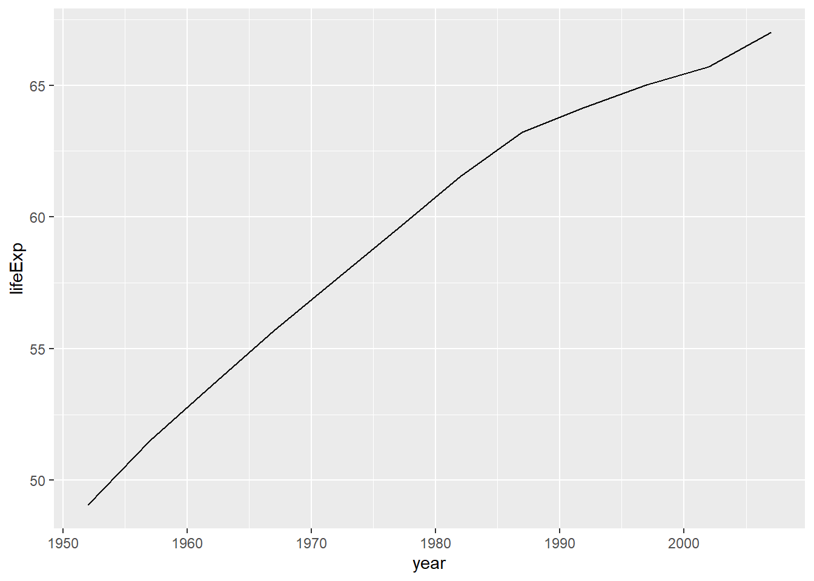
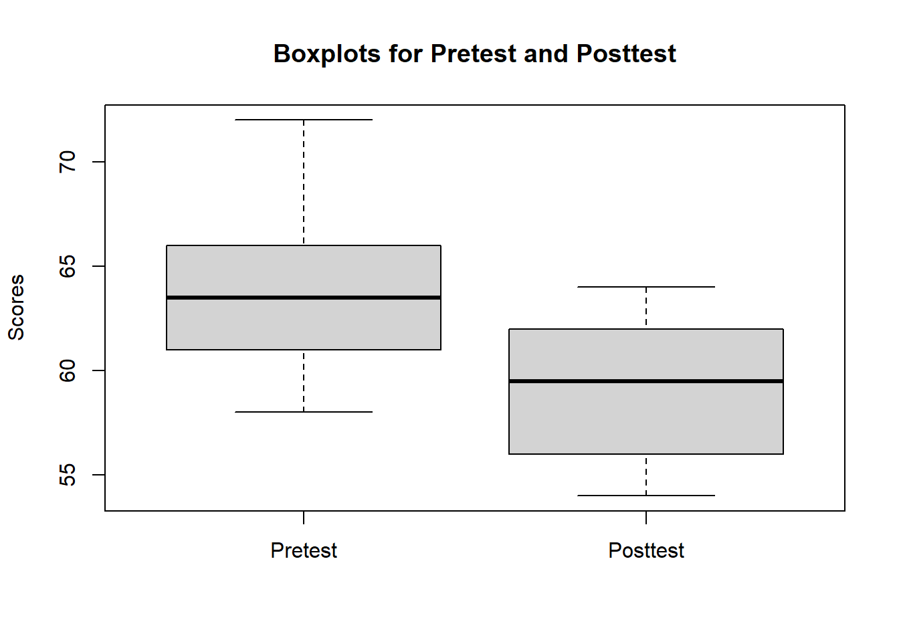
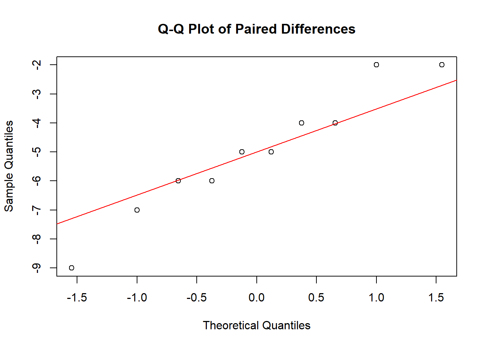
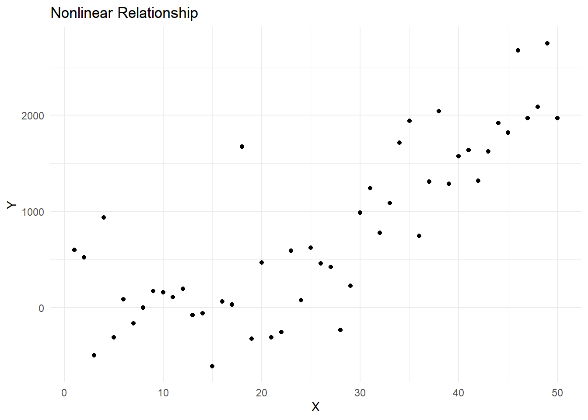

# Welcome! {.unnumbered}

{style="align:center"}

This book covers practical worked out examples which you can easily apply to your data set and also includes a discussion on how the example is working. We will cover descriptive and basic inferential statistics, including graphs, frequency distributions, central tendency, dispersion, probability, hypothesis testing, tests of mean differences, correlation, simple regression, and chi-square tests. This book is designed to facilitate graduate students of Educational Psychology to develop their knowledge and understanding of various statistical concepts and procedures in R programming as a supplement resource.

## General Objectives {.unnumbered}

This book is based on a 3 credit semester course "Quantitative Methods - I" as taught in University of Oklahoma in Fall 2022. After thoroughly following the procedures and going through the examples , a learner will be able to

-   **Identify** variables correctly falling at different scales of measurement.

-   **Identify** appropriate techniques for analyzing data when presented with variables with different measurement characteristics.

-   **Set up** and manage data sets containing variables in R and RStudio.

-   **Analyze** data sets using quantitative techniques using R.

-   **Distinguish** between null and alternative (research) hypotheses.

-   **Distinguish** between a directional and non-directional hypothesis.

-   **Demonstrate** the concepts of "statistical significance" and "effect size".

-   **Analyze** the effects of sampling (e.g., size, strategies) on inferences concerning population estimates.

-   **Interpret** the results of statistical analyses.


<!--chapter:end:index.Rmd-->

# Preface {.unnumbered}

## Acknolwedgement

I would like to sincerely thank my professor and academic advisor **Dr Howard M. Crowson** [@statisti] [@mikecro] for providing me this wonderful opportunity to compile the resource materials in R along with providing me ample time weekly for consultation and support. You can also [follow him here](https://www.youtube.com/channel/UC8r94_jZaoXv9qsgFwAdPQQ) for his insightful lectures on basic and advanced statistial concepts and procedure.

I would also like to extend my gratitude to the authors of the textbook "**An Introduction to Statistical Concepts" by Hahs-Vaughn and Lomax, 4th edition**, and for providing a comprehensive resource that guided my exploration of various statistical concepts and methodologies. The textbook served as an invaluable reference, helping to gain a deeper understanding of the topics and apply them in practical examples using R programming. All the example data and text references are inspired from this textbook.

I also appreciate the developers and maintainers of the [R language](https://www.r-project.org/), R packages, and related tools for their dedicated work in providing a powerful and accessible platform for statistical computing and data analysis. In particular, we would like to acknowledge the creators of the `bookdown`[@bookdown2016], rmarkdown[@rmarkdown2020], ggplot2 [@ggplot2], psych [@psych], lavaan [@lavaan], and all other packages used throughout the guide, which were instrumental in demonstrating various statistical concepts and procedures throughout this book and also useful for social science research.

## Conventions Used in the Book

Code chunks will be presented in a typical Markdown format as such, with the code output below:


```r
#This is a code block. 
("Hello world")
#> [1] "Hello world"
```

*Italic*

:Indicates new terms, packages name, URLs, email addresses, filenames, and file extensions.

> **Tip**
>
> This icon signifies a tip, suggestion, or general note.

> **Caution**
>
> This icon indicates a warning or caution.

Finally, here is the R version I am currently using:


```r
version
#>                _                                
#> platform       x86_64-w64-mingw32               
#> arch           x86_64                           
#> os             mingw32                          
#> crt            ucrt                             
#> system         x86_64, mingw32                  
#> status                                          
#> major          4                                
#> minor          2.2                              
#> year           2022                             
#> month          10                               
#> day            31                               
#> svn rev        83211                            
#> language       R                                
#> version.string R version 4.2.2 (2022-10-31 ucrt)
#> nickname       Innocent and Trusting
```

## Example Data

All the example data I have used are form the textbook[@hahs-vaughn2020]. It can be downloaded the [official website of the textbook](https://routledgetextbooks.com/textbooks/9781138650558/stats4e.php) or from my [github](https://github.com/hukkum/quant-r/tree/dev/exampledata). Some of the example data compiled form other sources are only available in github.

<!--chapter:end:00-preface.Rmd-->

# R Basics

This sections covers everything you need to get run statistical analysis using R. Just like other programming language, R also has a base package and an Integrated Development Environment. Base package is what you need to run your R code in your computer. R Studio is an IDE developed specifically focussing on development of R programs and packages.

## Installing R base package.

R base package can be downloaded from [official website](https://cran.r-project.org/) of R. Once, you enter inside the website select the package for your operating system, download the file and install it. To ensure R is successfully installed, you should be able to run it from your command prompt or terminal using `R` command. Type `q()` to quit R console.

```         
$ R

R version 4.2.1 (2022-06-23 ucrt) -- "Funny-Looking Kid"
Copyright (C) 2022 The R Foundation for Statistical Computing
Platform: x86_64-w64-mingw32/x64 (64-bit)

R is free software and comes with ABSOLUTELY NO WARRANTY.
You are welcome to redistribute it under certain conditions.
Type 'license()' or 'licence()' for distribution details.

  Natural language support but running in an English locale

R is a collaborative project with many contributors.
Type 'contributors()' for more information and
'citation()' on how to cite R or R packages in publications.

Type 'demo()' for some demos, 'help()' for on-line help, or
'help.start()' for an HTML browser interface to help.
Type 'q()' to quit R.

> q()
```

### Download R studio

Well, we do not need to do everything from command or terminal. R community has also a fully fledged development environment called R Studio which is free to use and very user friendly to work in R. You can download R studio from [here](https://posit.co/download/rstudio-desktop/).

The following resources provide an overview and introduction to the various components of R Studio:

-   [**RStudio IDE Cheat Sheet**](https://www.rstudio.com/wp-content/uploads/2016/01/rstudio-IDE-cheatsheet.pdf)

-   [**Getting Started with RStudio**](https://support.rstudio.com/hc/en-us/articles/201141096-Getting-Started-with-RStudio)

This tutorial will help you understand the basic overview and components of R studio.

## R Packages

While R is simply a statistically programming language, the R packages developed by R community has been one of the key reason of its robustness, reproducibility and flexibility. Many statistics programmers have developed 100s of packages which we can run even complex statistics functions with single line of code. We will be using a few key packages throughout our examples and also discuss about those packages.

## R Console

The R Console is the interactive command-line interface for R, where you can enter commands and see their output. It's an essential component of RStudio, and you can use it for various tasks such as data manipulation, statistical analysis, and creating graphics.

## Getting Help

Here are few useful syntax to ask for help

```         
{Get help for an object, in this case for the –-plot– function. 
?plot  #You can also type: help(plot)

#Search the help pages for anything that has the word "regression". 
??regression #You can also type:  help.search("regression")

#Search the word "age" in the objects available in the current R session.
 apropos("age")
help(package=car) # View documentation in package ‘car’. You can also type: library(help="car“)
help(DataABC) # Access codebook for a dataset called ‘DataABC’ in the package ABC
args(log) # Description of the command.}
```

## **R Community and Resources**

R has a large community of developers and supporters. The following resources may be helpful as you progress in your research and experiments with R:

### **Documentation / Websites**

1.  [**R Documentation**](https://www.rdocumentation.org/)

2.  [**R-bloggers**](https://www.r-bloggers.com/)

3.  [**RStudio Community**](https://community.rstudio.com/)

4.  [**Stack Overflow**](https://stackoverflow.com/questions/tagged/r)

### **Books**

1.  Field, A., Miles, J., & Field, Z. (2012). Discovering statistics using R. London: Sage Publications.

2.  Kabacoff, R. I. (2015). R in action: Data analysis and graphics with R. Manning Publications Co.

3.  Navarro, D. J. (2015). Learning statistics with R: A tutorial for psychology students and other beginners. University of Adelaide.

4.  Wickham, H. (2014). Advanced R. CRC Press.

5.  Wilke, C. O. (2019). Fundamentals of Data Visualization: A Primer on Making Informative and Compelling Figures. O'Reilly Media.

### **Cheatsheets**

1.  [**RStudio Cheatsheets**](https://rstudio.com/resources/cheatsheets/)

2.  [**DataCamp Cheatsheets**](https://www.datacamp.com/community/data-science-cheatsheets)

<!--chapter:end:000-RBasics.Rmd-->

# Basic Statistical Concepts

## Population and Sample

### Population

A population is the entire group of individuals, objects, or events that we are interested in studying. It includes all possible cases that meet the defined criteria for the study. For example, the population of interest for a study on student performance may include all students in a specific school, district, or country.

**Characteristics of a population:**

-   The population is usually large, and it is often impractical or impossible to study the entire population.
-   The population has fixed and known statistical properties, such as population mean, variance, and standard deviation.
-   The statistical properties of the population can be estimated through a census or other data collection methods.
-   Research conducted on a population is often aimed at generalizing the results to the entire population.

### Population Parameters:

Population parameters are characteristics of a variable in a population. These parameters are usually unknown and must be estimated from a sample. Some common population parameters are:

**Population Mean (μ)**: The average value of a variable in a population.

**Population Variance (σ\^2)**: A measure of the variability or spread of a variable in a population.

**Population Standard Deviation (σ)**: The square root of the population variance, often used as a measure of the spread of a variable in a population.

**Population Proportion (p)**: The proportion of individuals in a population with a certain characteristic.

### Sample

A sample is a subset of the population that is selected to represent the population. It is a smaller group of cases that are selected from the population for the purpose of conducting research. For example, a sample of students may be selected from a school to participate in a study on student performance.

**Characteristics of a sample:**

-   The sample is smaller than the population and represents only a portion of the population.
-   The statistical properties of the sample are used to estimate the population parameters, but these estimates are subject to sampling variability.
-   Data is collected from a sample of the population, and statistical inference is used to make inferences about the population based on the sample.
-   Research conducted on a sample is often aimed at making inferences about the population based on the sample data.

We will be focussing on sample statistics while refering to descriptive statistics and use these statistics to infer the predictions for the larger population.

## Data Types

Data types idea in computer science and program shares similar nomenclature in case of statistics. Data is broadly classified into constant and variables in terms of its nature during the execution of the analysis or the statistical program.

**Constant** are those kind of data types which are not changed during the program or during analysis. For eg, the value of alpha (alpha) is always kept constant.

**Variables** are those data types which are changed or have multiple values in the program.

## Types of variable

1.  **Quantitative Variables (Continuous and Discrete):**

-   Continuous Variables: Variables that can take any value within a range, typically measured on a continuous scale. Example: Height, weight, or temperature.
-   Discrete Variables: Variables that can only take specific values, usually whole numbers or counts. Example: Number of students in a class, or number of books in a library.

2.  **Qualitative Variables (Nominal and Ordinal):**

-   Nominal Variables: Variables that represent categories without any inherent order. Example: Gender (male or female), or types of food (vegetarian or non-vegetarian).
-   Ordinal Variables: Variables that represent categories with a natural order or ranking. Example: Education level (elementary, high school, or college), or customer satisfaction ratings (poor, average, or excellent).


```r
   VARIABLES
                               |
                    +----------+-----------+
                    |                      |
              Quantitative           Qualitative
                    |                      |
             +------+-------+      +-------+-------+
             |              |      |               |
        Continuous    Discrete   Nominal      Ordinal

```

## Types of scales of measurement of variables

Four different types of scales of measurement are presented in the table below.

| **Scale of Measurement** | **Description**                                                                                    | **Example**                                             |
|----------------|------------------------------------|--------------------|
| Nominal                  | Categorical data without any inherent order or ranking. Each value represents a distinct category. | Gender (male or female), colors, or religion.           |
| Ordinal                  | Categorical data with a natural order or ranking, but without a specific numerical value.          | Education level, Likert scale, or age group.            |
| Interval                 | Numeric data with a constant difference between values, but no true zero point.                    | Temperature (Celsius or Fahrenheit), or calendar years. |
| Ratio                    | Numeric data with a constant difference between values and a true zero point.                      | Age, height, weight, or income.                         |

<!--chapter:end:01-statconcept.Rmd-->

# Loading Data in R

Data set can be directly imported or can be entered manually directly into R ans save as a R data file also. Lets see how we can manually enter and save or import different data formats in R Studio.

## Entering Data in R

We can start working in R right away by entering the data in R. To enter numerical data manually, `c` (stands for 'column') command is used.

```         
  age <- c(45, 23, 36, 29)
  
```

Similarly, categorical data can also be entered using quotation marks.

```         
  gpa <- c("A+", "A", "B+", "B")
  
```

## Importing CSV file

read command function in R is used to read the data files. To read CSV file, you can simply move the CSV file into the working directory and load the file using read.csv command. You will need the readr package to read CSV file.

```         
'''library (readr)
  csv1 <- read.csv("records.csv")
  
  #To view the structure
  str(csv1)
  
  #To view the CSV file
  csv1
  '''
```

Here, csv1 in the name assigned to the CSV file in R environment. You will be using the same variable name whenever you want to work with the csv file you imported.

## Importing SPSS and STATA file

R also has a package called 'haven' which helps us read the SPSS and STATA data files easily in R. After installing the haven package, we use read_sav command to import the SPSS file.

```         
  #Install package
  install.packages('haven')
  
  #Load the package and read SPSS data file
  
  library(haven)
  savdata1 <- read_sav('C:\\Users\\para\\Downloads\\ancova.sav')
  
  #To verify the file has been imported successfully.
  savdata1
  
  #Load the package and read STATA data file
  
  library(haven)
  dtadata1 <- read_dta('C:\\Users\\para\\Downloads\\ancovastata.dta')
  
  #To verify the file has been imported successfully.
  dtadata1
  
```

Note: It seems like we should be using \\ instead of  while writing the path name to prevent the error : `Error: '\U' used without hex digits in character string starting "'C:\U"1`

## Importing Excel File

*readxl* package is used to read the excel file in R environment.

```         
 #Install package
  install.packages('readxl')
  
  #Load the package and read data
  
  library(readxl)
  xlsdata1 <- read_excel('C:\\Users\\para\\Downloads\\ancova.xls')
  
  #To verify the file has been imported successfully.
  xlsdata1
  
```

*R has comprehensive packages to import from multiple statistical systems. Some packages include foreign, readdta1 etc. Find more about Data Import and Export in R [here](https://cran.r-project.org/doc/manuals/r-release/R-data.html).*

<!--chapter:end:02-datainR.Rmd-->

# Data Representation
Data representation refers to the process of presenting data in a visual or graphical format that makes it easier to understand and interpret. It is crucial to effectively represent data to communicate research findings, identify trends, and explore relationships between variables. 

Examples of data representation techniques in educational psychology might include creating line graphs to show changes in student performance over time, using pie charts to compare student achievement across different demographic groups, or using scatter plots to explore the relationship between two or more variables in a study.

 `ggplot2` is a powerful data visualization package in R, created by Hadley Wickham. It is based on the Grammar of Graphics, a framework that allows you to build complex and customizable plots by layering components. ggplot2 enables the creation of a wide variety of visually appealing and informative graphics with a relatively concise and consistent syntax.
 ggplot(gapminder, aes(x = lifeExp)): This initializes a ggplot2 plot using the gapminder dataset. The aes() function sets the aesthetic mappings for the plot. In this case, the x-axis is mapped to the lifeExp variable from the dataset, which represents life expectancy.

geom_histogram(binwidth = 5): This adds a histogram layer to the plot. The binwidth parameter is set to 5, which means that the data will be divided into bins of width 5. The height of each bar in the histogram represents the frequency (count) of data points within each bin.

xlab("Life Expectancy"): This adds a label to the x-axis, naming it "Life Expectancy".

ylab("Frequency"): This adds a label to the y-axis, naming it "Frequency".

## Loading your data
You can import or load your data as we discussed in Chapter 3. In these  exmaples, I will be loading gapminder dataset which is available as a package in R. 


```r
# Load required packages
library(ggplot2)
library(gapminder)

# Preview the dataset
head(gapminder)
```


## Frequency Tables 
A frequency table displays the number of occurrences (frequencies) for each category or value in a data set. It is particularly useful for summarizing categorical data or discrete numerical data.


```r
# Load required packages
library(ggplot2)
```

```
#> Warning: package 'ggplot2' was built under R version 4.2.3
```

```r
library(gapminder)
```

```
#> Warning: package 'gapminder' was built under R version
#> 4.2.3
```

```r
# Create a frequency table for continent
continent_freq <- table(gapminder$continent)
continent_freq
```

```
#> 
#>   Africa Americas     Asia   Europe  Oceania 
#>      624      300      396      360       24
```

## Histograms:

Histograms are used to visualize the distribution of continuous or discrete numerical data. They display the data using intervals (bins) along the x-axis and the frequency of observations within each bin on the y-axis.


```r
# Histogram for life expectancy using ggplot2
ggplot(gapminder, aes(x = lifeExp)) + geom_histogram(binwidth = 5) + xlab("Life Expectancy") + ylab("Frequency")
```


The `aes()` function sets the aesthetic mappings for the plot. In this case, the x-axis is mapped to the lifeExp variable from the dataset, which represents life expectancy.

`geom_histogram(binwidth = 5)`adds a histogram layer to the plot. The binwidth parameter is set to 5, which means that the data will be divided into bins of width 5. The height of each bar in the histogram represents the frequency (count) of data points within each bin.

`xlab("Life Expectancy")` adds a label to the x-axis, naming it "Life Expectancy".

`ylab("Frequency")`adds a label to the y-axis, naming it "Frequency".


## Bar Graphs:

Bar graphs are used for displaying categorical data. Each category is represented by a bar, and the height (or length) of the bar indicates the frequency or count of that category.


```r
# Bar graph of continents using ggplot2
ggplot(gapminder, aes(x = continent)) + geom_bar()
```


## Pie Charts:

Pie charts represent categorical data as slices of a circle. The size of each slice is proportional to the frequency of each category. Pie charts are useful for visualizing relative proportions of categories. Drawing piechart in `ggplot2` package requires transofrming a bar plot to polar coordinates, however, its much easier with `plotrix` package. You can install this package using `install.packages(plotrix)`.


```r
# Load necessary package
library(plotrix)

# Pie chart for continents
pie3D(table(gapminder$continent), labels = names(table(gapminder$continent)), main = "Proportion of Continents")
```


## Box Plots:

Box plots are used for visualizing the distribution of continuous or discrete numerical data. They show the median, quartiles, and outliers of the data, providing a compact and informative representation of the data distribution.


```r
# Box plot of life expectancy by continent using ggplot2
ggplot(gapminder, aes(x = continent, y = lifeExp)) + geom_boxplot()
```


## Scatter Plots
Scatter plots are used to display the relationship between two continuous variables. They can be particularly helpful in identifying trends, correlations, and potential outliers in the data.


```r
# Scatter plot of life expectancy vs. GDP per capita using ggplot2
ggplot(gapminder, aes(x = gdpPercap, y = lifeExp)) + geom_point() + scale_x_log10()
```


## Line Graphs
Line graphs are used to display the relationship between a continuous variable and a discrete or ordinal variable, often representing change over time. They can be particularly useful for identifying trends and patterns in time-series data.


```r
# Line graph of average life expectancy over time using ggplot2
gapminder_agg <- aggregate(lifeExp ~ year, data = gapminder, mean)
ggplot(gapminder_agg, aes(x = year, y = lifeExp)) + geom_line()
```




<!--chapter:end:03-frequencyandplot.Rmd-->

# Describing Data in R

Describing data is the process of summarizing and interpreting information that has been collected through research or observation.

To describe data, we typically use statistical measures such as measures of central tendency (e.g., mean, median, mode) and measures of variability (e.g., range, variance, standard deviation). These measures help us to understand the distribution of the data, including how the data is spread out and whether it is skewed or symmetrical.

When describing data, it's important to consider the research question or hypothesis that is being investigated. By focusing on the relevant aspects of the data and using appropriate statistical and visual tools, we can better understand the underlying trends and relationships in the data and draw meaningful conclusions that can inform future research or educational practice.

## Central Tendency:

Central tendency measures provide a single value that represents the center or "typical" value of a dataset. The primary measures of central tendency are the mean, median, and mode.

### Sample Mean

The sample mean is the average value of a variable in a sample. It is denoted by the symbol "x̄".

The sample mean, often referred to as the average, is the sum of all data points divided by the total number of data points. The mean is sensitive to extreme values (outliers) and may not always represent the true center of the data.

$\bar{x} = \frac{1}{n}\sum_{i=1}^{n} x_i$

where $\bar{x}$ is the mean, $n$ is the total number of data points, and $x_i$ are the individual data points.

In R, we can calculate the mean using the **`mean()`** function. For example:


```r
# Example: Mean test scores of all students in a school
scores <- c(80, 85, 90, 75, 95, 85, 70, 75, 90, 80)
mean(scores)
#> [1] 82.5
```

### Median

The median is the middle value of a dataset when it is sorted in ascending or descending order. If the dataset has an odd number of data points, the median is the middle value; if it has an even number of data points, the median is the average of the two middle values. The median is less sensitive to extreme values compared to the mean.

t is represented as:

$median = \begin{cases} x_{(n+1)/2} &\text{if }n\text{ is odd}\ \frac{x_{n/2} + x_{(n/2)+1}}{2} &\text{if }n\text{ is even} \end{cases}$

where $n$ is the total number of data points, and $x_{(n+1)/2}$ and $x_{n/2}$ are the middle values for odd and even $n$ respectively.


```r
# Example: Median income
income <- c(25000, 30000, 35000, 40000, 45000, 50000) # income data
median(income) # calculate the median
#> [1] 37500
```

### Mode

The mode is the value that occurs most frequently in a dataset. A dataset can have more than one mode (multimodal) or no mode (no value occurs more than once). The mode can be used for both numerical and categorical data.

## Measures of Dispersion

Measures of dispersion are statistical values that describe the degree of spread or variability of a dataset. There are several measures of dispersion, including the range, interquartile range, variance, and standard deviation. In this section, we will discuss each measure of dispersion and its formula in detail.

### Range:

The range is the simplest measure of dispersion that gives the difference between the maximum and minimum values in a dataset. It provides an idea of how spread out the data is. However, it is highly sensitive to outliers and does not provide information about the distribution's shape. The formula for the range is as follows:

```{=tex}
\begin{equation}
Range = Max(X) - Min(X)
\end{equation}
```
The range() function returns the difference between the maximum and minimum values in a dataset, providing a measure of the spread of data around them.


```r
# Example dataset
income <- c(25000, 30000, 35000, 40000, 45000, 50000)
# Calculate range
range(income)
#> [1] 25000 50000
```

### Interquartile Range (IQR):

The interquartile range (IQR) is the measure of dispersion that indicates the spread of the middle 50% of the data. It is less sensitive to outliers than the range. The IQR is defined as the difference between the first quartile (Q1, the 25th percentile) and the third quartile (Q3, the 75th percentile) of a dataset. The formula for IQR is as follows:

```{=tex}
\begin{equation}
IQR = Q3 - Q1
\end{equation}
```
where Q1 is the first quartile and Q3 is the third quartile of the dataset.

The IQR() function calculates the difference between the 75th percentile (Q3) and the 25th percentile (Q1) of a dataset, providing a measure of the spread of the middle 50% of the data.


```r
IQR(income)
#> [1] 12500
```

### Variance:

The variance is a measure of dispersion that quantifies the average deviation of data points from the mean. It measures how far a set of numbers is spread out from their average value. The variance is expressed in squared units and is influenced by outliers. There are two types of variance: population variance and sample variance.

Population variance is used when the entire population is available, while sample variance is used when only a sample of the population is available. The formula for population variance is as follows:

```{=tex}
\begin{equation}
\sigma^2 = \frac{\sum(X - \mu)^2}{N}
\end{equation}
```
where X is the data point, μ is the mean of the dataset, and N is the total number of data points in the population.

The formula for sample variance is slightly different and is as follows:

```{=tex}
\begin{equation}
s^2 = \frac{\sum(X - \bar{x})^2}{n - 1}
\end{equation}
```
where X is the data point, $\bar{x}$ is the mean of the sample, and n is the sample size.

`var()` function is used to calcultate the variance.


```r
# Calculate variance
var(income)
#> [1] 87500000
```

### Standard Deviation:

The standard deviation is the square root of the variance. It is a widely used measure of dispersion that measures the average deviation of data points from the mean. It is expressed in the same units as the data and is sensitive to outliers, just like variance. There are two types of standard deviation: population standard deviation and sample standard deviation.

The formula for population standard deviation is as follows:

```{=tex}
\begin{equation}
\sigma = \sqrt{\sigma^2}
\end{equation}
```
where $\sigma^2$ is the population variance.

The formula for sample standard deviation is slightly different and is as follows:

```{=tex}
\begin{equation}
s = \sqrt{s^2}
\end{equation}
```
where s\^2 is the sample variance.

`sd()` function is used to calculate the standard deviation.


```r
# Calculate standard deviation
sd(income)
#> [1] 9354.143
```

## The `psych` package - Kitchen knife of social scientists

The psych package in R is a popular package for psychometrics and psychological research. It contains various functions for data manipulation, visualization, and statistical analysis. Some of the commonly used functions in the psych package include `describe()`, `alpha()`, and `fa()`.

### The `describe()` Function

The describe() function in the psych package provides a summary of a dataset's variables. It includes the number of observations, mean, standard deviation, minimum, maximum, and other useful statistics. Here's an example:


```r
# Load required packages and dataset
library(psych)
#> Warning: package 'psych' was built under R version 4.2.3
library(ISLR)
#> Warning: package 'ISLR' was built under R version 4.2.3
data("College") 
```

Descriptives of *income* dataset


```r

#view summary of the income data
describe(income)
#>    vars n  mean      sd median trimmed     mad   min   max
#> X1    1 6 37500 9354.14  37500   37500 11119.5 25000 50000
#>    range skew kurtosis      se
#> X1 25000    0     -1.8 3818.81
```

We will use the College dataset from the ISLR package [@ISLR] . This dataset contains information on a number of colleges in the US, including variables such as acceptance rate, graduation rate, and median SAT score.


```r
# View summary statistics of the college dataset
describe(College)
#>             vars   n     mean      sd median  trimmed
#> Private*       1 777     1.73    0.45    2.0     1.78
#> Apps           2 777  3001.64 3870.20 1558.0  2193.01
#> Accept         3 777  2018.80 2451.11 1110.0  1510.29
#> Enroll         4 777   779.97  929.18  434.0   575.95
#> Top10perc      5 777    27.56   17.64   23.0    25.13
#> Top25perc      6 777    55.80   19.80   54.0    55.12
#> F.Undergrad    7 777  3699.91 4850.42 1707.0  2574.88
#> P.Undergrad    8 777   855.30 1522.43  353.0   536.36
#> Outstate       9 777 10440.67 4023.02 9990.0 10181.66
#> Room.Board    10 777  4357.53 1096.70 4200.0  4301.70
#> Books         11 777   549.38  165.11  500.0   535.22
#> Personal      12 777  1340.64  677.07 1200.0  1268.35
#> PhD           13 777    72.66   16.33   75.0    73.92
#> Terminal      14 777    79.70   14.72   82.0    81.10
#> S.F.Ratio     15 777    14.09    3.96   13.6    13.94
#> perc.alumni   16 777    22.74   12.39   21.0    21.86
#> Expend        17 777  9660.17 5221.77 8377.0  8823.70
#> Grad.Rate     18 777    65.46   17.18   65.0    65.60
#>                 mad    min     max   range  skew kurtosis
#> Private*       0.00    1.0     2.0     1.0 -1.02    -0.96
#> Apps        1463.33   81.0 48094.0 48013.0  3.71    26.52
#> Accept      1008.17   72.0 26330.0 26258.0  3.40    18.75
#> Enroll       354.34   35.0  6392.0  6357.0  2.68     8.74
#> Top10perc     13.34    1.0    96.0    95.0  1.41     2.17
#> Top25perc     20.76    9.0   100.0    91.0  0.26    -0.57
#> F.Undergrad 1441.09  139.0 31643.0 31504.0  2.60     7.61
#> P.Undergrad  449.23    1.0 21836.0 21835.0  5.67    54.52
#> Outstate    4121.63 2340.0 21700.0 19360.0  0.51    -0.43
#> Room.Board  1005.20 1780.0  8124.0  6344.0  0.48    -0.20
#> Books        148.26   96.0  2340.0  2244.0  3.47    28.06
#> Personal     593.04  250.0  6800.0  6550.0  1.74     7.04
#> PhD           17.79    8.0   103.0    95.0 -0.77     0.54
#> Terminal      14.83   24.0   100.0    76.0 -0.81     0.22
#> S.F.Ratio      3.41    2.5    39.8    37.3  0.66     2.52
#> perc.alumni   13.34    0.0    64.0    64.0  0.60    -0.11
#> Expend      2730.95 3186.0 56233.0 53047.0  3.45    18.59
#> Grad.Rate     17.79   10.0   118.0   108.0 -0.11    -0.22
#>                 se
#> Private*      0.02
#> Apps        138.84
#> Accept       87.93
#> Enroll       33.33
#> Top10perc     0.63
#> Top25perc     0.71
#> F.Undergrad 174.01
#> P.Undergrad  54.62
#> Outstate    144.32
#> Room.Board   39.34
#> Books         5.92
#> Personal     24.29
#> PhD           0.59
#> Terminal      0.53
#> S.F.Ratio     0.14
#> perc.alumni   0.44
#> Expend      187.33
#> Grad.Rate     0.62
```

<!--chapter:end:04-Rdescriptives.Rmd-->

---
editor_options: 
  markdown: 
    wrap: 72
---

# Normal Distribution

The normal distribution is a fundamental concept in statistics and probability theory. It is a bell-shaped, continuous probability distribution that is symmetrical and fully determined by two parameters: the mean (μ) and the standard deviation (σ). The normal distribution is characterized by the following properties:

- It is continuous and takes on all possible real values.
- It is symmetric around the mean, which is the highest point of the curve.
- It has a bell-shaped curve, with most of the data clustered around the mean and gradually decreasing in frequency as you move away from the mean.
- It is fully specified by its mean and standard deviation, with the 68-95-99.7 rule describing how much of the data falls within one, two, or three standard deviations from the mean.
- It is widely used to model many natural phenomena and measurements in the social and natural sciences.

One of the key properties of the normal distribution is the 68-95-99.7 rule, also known as the empirical rule or the three-sigma rule. According to this rule, approximately 68% of the data falls within one standard deviation of the mean, 95% of the data falls within two standard deviations of the mean, and 99.7% of the data falls within three standard deviations of the mean. This property makes the normal distribution useful for making probabilistic statements about the data.The Normal distribution is a continuous, symmetric, bell-shaped
distribution that is defined by two parameters: the mean (μ) and the
standard deviation (σ).

The mean (μ) determines the center of the distribution, and the standard
deviation (σ) controls the spread or dispersion of the data.
Approximately 68% of the data falls within one standard deviation from
the mean, 95% falls within two standard deviations, and 99.7% falls
within three standard deviations. This is known as the Empirical Rule or
the 68-95-99.7 rule.

The probability density function (PDF) of the Normal distribution is
given by:

$f(x) = \frac{1}{\sigma \sqrt{2\pi}} \cdot e^{-\frac{1}{2} \left(\frac{x-\mu}{\sigma}\right)^2}$

Where:

f(x) is the probability density at point x μ is the mean of the
distribution σ is the standard deviation of the distribution e is the
base of the natural logarithm (approximately 2.718) π is the
mathematical constant Pi (approximately 3.141) .

## Unit Normal Distribution

A unit normal distribution is a normal distribution with a mean of 0 and a standard deviation of 1. It is also known as the standard normal distribution or the Z-distribution. The concept of a unit normal distribution is useful because any normal distribution can be transformed into a unit normal distribution through a process called standardization. Standardization involves subtracting the mean from each data point and then dividing by the standard deviation. This transforms the data into a Z-score, which represents the number of standard deviations away from the mean.


```r
# Load required libraries
library(ggplot2)
#> Warning: package 'ggplot2' was built under R version 4.2.3

# Define the mean and standard deviation
mean <- 0
sd <- 1

# Generate a sequence of x values
x <- seq(-4, 4, length.out = 1000)

# Calculate the probability density function for the x values
pdf <- dnorm(x, mean = mean, sd = sd)

# Create the plot
ggplot() +
  geom_line(aes(x, pdf), color = "blue") +
  geom_ribbon(aes(x = x, ymin = 0, ymax = pdf, fill = factor((x > mean - sd) & (x < mean + sd))), alpha = 0.3) +
  geom_ribbon(aes(x = x, ymin = 0, ymax = pdf, fill = factor((x > mean - 2*sd) & (x < mean + 2*sd))), alpha = 0.3) +
  geom_ribbon(aes(x = x, ymin = 0, ymax = pdf, fill = factor((x > mean - 3*sd) & (x < mean + 3*sd))), alpha = 0.3) +
  xlab("X") +
  ylab("Probability Density") +
  ggtitle("Normal Distribution (μ = 0, σ = 1)") +
  scale_fill_manual(values = c("grey70", "grey50"), guide = FALSE) +
  theme_minimal()
#> Warning: The `guide` argument in `scale_*()` cannot be `FALSE`. This
#> was deprecated in ggplot2 3.3.4.
#> ℹ Please use "none" instead.
#> This warning is displayed once every 8 hours.
#> Call `lifecycle::last_lifecycle_warnings()` to see where
#> this warning was generated.
```


This R code generates a plot of the Normal distribution with a mean of 0
and a standard deviation of 1, which is also known as the standard
Normal distribution or the Z-distribution. The plot shows the
bell-shaped curve of the distribution, illustrating how the data is
symmetric around the mean and decreases as you move away from the
center.

The normal distribution also relates to the concepts of skewness and kurtosis. Skewness refers to the degree of asymmetry in a distribution, with positive skewness indicating that the distribution is skewed to the right and negative skewness indicating that the distribution is skewed to the left. The normal distribution has a skewness of 0, indicating perfect symmetry. Kurtosis refers to the degree of peakedness in a distribution, with high kurtosis indicating a sharp peak and low kurtosis indicating a flat peak. The normal distribution has a kurtosis of 3, which is known as mesokurtic. Distributions with higher kurtosis are called leptokurtic and those with lower kurtosis are called platykurtic.

# Skewness and Kurtosis

Skewness and Kurtosis are two different measures of shapes and
distribution of a dataset in qualitative methods.

## Skewness

Skewness is a measure of the asymmetry of a distribution. It describes
the degree to which the distribution deviates from a symmetric shape. A
skewness value of 0 indicates a perfectly symmetric distribution.
Positive skewness indicates a distribution with a longer tail on the
right side, while negative skewness indicates a longer tail on the left
side.

## Kurtosis

Kurtosis is a measure of the "tailedness" or "peakedness" of a
distribution. It describes how the distribution's tails and peak compare
to a normal distribution. A kurtosis value of 0 indicates a distribution
with a similar shape to a normal distribution. Positive kurtosis
indicates a distribution with heavier tails and a more peaked shape than
a normal distribution, while negative kurtosis indicates lighter tails
and a less peaked shape.

## Generating Skewness and Kurtosis using R

We can use the same *psych* package to generate skewness and Kurtosis.

<!--chapter:end:05-normaldistribution.Rmd-->

# Standard Scores
Standard scores are a type of transformed scores that express individual data points in a dataset relative to the mean and standard deviation of that dataset. Standard scores allow for comparing scores across different distributions or scales by placing them on a common scale. They provide a standardized measure of the position of a data point within its distribution, taking into account both the average value (mean) and the spread (standard deviation) of the data.

## Z- Score
A z-score is a type of standard score that is calculated by subtracting the mean (μ) from an individual data point (X) and dividing the result by the standard deviation (σ):

z = (X - μ) / σ

A z-score represents how many standard deviations a data point is from the mean. A positive z-score indicates that a data point is above the mean, while a negative z-score indicates that it is below the mean. A z-score of 0 corresponds to the mean of the distribution.

In educational settings, z-scores can be used in various ways, such as:

Comparing student performance: Z-scores enable comparison of student scores across different tests or grading scales by standardizing the scores. This allows educators to make more informed decisions about student performance and identify students who might need additional support or resources.

Identifying outliers: Z-scores can help identify students who perform exceptionally well or poorly compared to the group mean. Outliers can provide insights into the effectiveness of teaching methods, identify areas for improvement, or recognize exceptional talent.

Normalizing grades: In cases where the distribution of grades is skewed, converting raw scores to z-scores can provide a more equitable assessment of student performance. Z-scores can then be converted to percentiles, which represent the percentage of students who scored lower than a particular student, providing a standardized ranking within the group.

To calculate z-scores in R, we can use the following code:

```r
# Example data
data <- c(60, 65, 70, 75, 80, 85, 90)

# Calculate the mean and standard deviation
mean_data <- mean(data)
sd_data <- sd(data)

# Calculate z-scores
z_scores <- (data - mean_data) / sd_data

z_scores
#> [1] -1.3887301 -0.9258201 -0.4629100  0.0000000  0.4629100
#> [6]  0.9258201  1.3887301
```

By understanding and utilizing z-scores in education, educators and researchers can make more informed decisions about student performance, compare results across different assessments, and identify patterns or trends in student achievement.


## T- Scores

A T-score is a type of standard score that is used to transform and standardize individual data points in a dataset. T-scores are similar to z-scores, but they use a different scaling factor to place the scores on a specific scale. T-scores are especially helpful when comparing scores across different distributions or scales.

A T-score is calculated by subtracting the mean (μ) from an individual data point (X), dividing the result by the standard deviation (σ), and then multiplying the result by a scaling factor (usually 10) and adding a constant (usually 50):

T = ((X - μ) / σ) * 10 + 50

The scaling factor of 10 and the constant of 50 ensure that the T-scores have a mean of 50 and a standard deviation of 10. The T-score transformation preserves the shape of the original distribution and the relative positions of the data points.

T-scores can be used in various ways:

Comparing scores across different tests or scales: T-scores enable the comparison of scores from different tests or grading scales by standardizing the scores to a common scale. This allows for more meaningful comparisons and helps in decision-making when considering different assessments.

Norm-referenced interpretation: T-scores are often used in standardized testing to provide a norm-referenced interpretation of test scores. This enables the comparison of an individual's performance to the performance of a reference group (e.g., age or grade peers).

Clinical and psychological assessments: T-scores are commonly used in clinical and psychological assessments to interpret scores on various tests or questionnaires, allowing practitioners to compare an individual's performance or symptoms to a normative sample.

To calculate T-scores in R, you can use the following code:

```r
# Example data
data <- c(60, 65, 70, 75, 80, 85, 90)

# Calculate the mean and standard deviation
mean_data <- mean(data)
sd_data <- sd(data)

# Calculate T-scores
t_scores <- ((data - mean_data) / sd_data) * 10 + 50
```

By understanding and utilizing T-scores, you can make more informed decisions about individual performance, compare results across different assessments, and identify patterns or trends in a standardized manner.


<!--chapter:end:06-standardscores.Rmd-->

# Probability and Inference

## Probability:

Probability is a numerical measure of the likelihood that a particular event will occur. It ranges from 0 to 1, with 0 meaning the event is impossible and 1 meaning the event is certain. Probabilities can be represented graphically using bar plots or pie charts.

## Sample Space:

The sample space is the set of all possible outcomes for a given experiment or event. For example, in a coin toss experiment, the sample space is {Heads, Tails}. The sample space can be represented using Venn diagrams or tree diagrams.

## Conditional Probability:

Conditional probability refers to the probability of an event occurring given that another event has already occurred. It can be represented graphically using Venn diagrams, which show the intersections of events.

## Independence:

Two events are independent if the occurrence of one event does not affect the probability of the other event. Graphically, independence can be visualized using Venn diagrams or probability tables, where the probability of the intersection of two events is equal to the product of their individual probabilities.

## Bayes' Theorem:

Bayes' theorem is a powerful tool for updating the probability of an event based on new evidence. It can be visualized using tree diagrams or probability tables, which show the updated probabilities after taking into account the new evidence.

## Discrete and Continuous Probability Distributions:

Discrete probability distributions describe the probabilities of outcomes for discrete random variables (e.g., number of heads in coin tosses), while continuous probability distributions describe the probabilities of outcomes for continuous random variables (e.g., height of individuals). Discrete distributions can be visualized using bar plots, and continuous distributions can be visualized using probability density functions or cumulative distribution functions.

<!--chapter:end:07-probabilityandinference.Rmd-->

#Sampling distribution

A sampling distribution is the probability distribution of a sample statistic (e.g., sample mean, sample proportion) obtained from a population. It helps to understand the variability of the sample statistic and the likelihood of obtaining different sample statistics from the population.

## Central Limit Theorem

The CLT states that, for a large enough sample size (usually n ≥ 30), the distribution of the sample means approaches a normal distribution, regardless of the shape of the population distribution. The mean of the sampling distribution is equal to the population mean (μ), and the standard deviation (standard error) is equal to the population standard deviation (σ) divided by the square root of the sample size (n).


```r
# Load required libraries
library(ggplot2)
#> Warning: package 'ggplot2' was built under R version 4.2.3

# Set seed for reproducibility
set.seed(123)

# Define population parameters
population_mean <- 10
population_sd <- 5

# Define sample size and number of samples
sample_size <- 50
num_samples <- 1000

# Generate random samples and calculate sample means
sample_means <- replicate(num_samples, mean(rnorm(sample_size, mean = population_mean, sd = population_sd)))

# Plot the distribution of sample means
ggplot(data.frame(sample_means), aes(x = sample_means)) +
  geom_histogram(aes(y = ..density..), bins = 30, fill = "lightblue", color = "black") +
  geom_density(color = "blue") +
  ggtitle("Sampling Distribution of the Mean") +
  xlab("Sample Means") +
  ylab("Density") +
  theme_minimal()
#> Warning: The dot-dot notation (`..density..`) was deprecated in
#> ggplot2 3.4.0.
#> ℹ Please use `after_stat(density)` instead.
#> This warning is displayed once every 8 hours.
#> Call `lifecycle::last_lifecycle_warnings()` to see where
#> this warning was generated.
```


## Confidence Intervals
Confidence intervals are a range of values within which the true population parameter is likely to fall, with a specified level of confidence (e.g., 95%). Confidence intervals provide an estimate of the precision and uncertainty of the sample statistic.

```r
# Define the sample data
sample_data <- c(12, 15, 18, 20, 22, 24, 25, 28, 30, 32)

# Calculate the sample mean and standard deviation
sample_mean <- mean(sample_data)
sample_sd <- sd(sample_data)

# Calculate the standard error
standard_error <- sample_sd / sqrt(length(sample_data))

# Calculate the 95% confidence interval
alpha <- 0.05
critical_value <- qnorm(1 - alpha / 2)
margin_of_error <- critical_value * standard_error
confidence_interval <- c(sample_mean - margin_of_error, sample_mean + margin_of_error)
```

<!--chapter:end:08-samplingdistribution.Rmd-->

# Hypothesis Testing
Hypothesis testing is a method used to make decisions about population parameters based on sample data.

## Hypothesis
A hypothesis is an educated guess or statement about the relationship between variables or the characteristics of a population. In hypothesis testing, there are two main hypotheses:

### Null hypothesis (H0):
This hypothesis states that there is no effect or no relationship between variables. It is typically the hypothesis that the researcher wants to disprove.

### Alternative hypothesis (H1): 
This hypothesis states that there is an effect or a relationship between variables. It is the hypothesis that the researcher wants to prove or provide evidence for.

## Decision Type Error
When performing hypothesis testing, there are two types of decision errors:

Type I Error (α): This error occurs when the null hypothesis is rejected when it is actually true. In other words, it's a false positive. The probability of committing a Type I error is denoted by the significance level (α), which is typically set at 0.05 or 0.01.
Type II Error (β): This error occurs when the null hypothesis is not rejected when it is actually false. In other words, it's a false negative. The probability of committing a Type II error is denoted by β. The power of a test (1 - β) measures the ability of the test to detect an effect when it truly exists.
Here is a graphical representation of the types of decision errors:

Hypothesis Testing Errors

````{.md eval=false}
|                  | Null Hypothesis (H0) is True | Null Hypothesis (H0) is False |
|------------------|------------------------------|-------------------------------|
| Reject H0        | Type I Error (α)             | Correct Decision (1 - β)      |
| Fail to Reject H0| Correct Decision (1 - α)     | Type II Error (β)             |
````

This table represents the different outcomes when making decisions based on hypothesis testing. The columns represent the reality (i.e., whether the null hypothesis is true or false), and the rows represent the decision made based on the hypothesis test (i.e., whether to reject or not reject the null hypothesis). The cells show the types of decision errors (Type I and Type II errors) and the correct decisions.


## Level of Signficance
The level of significance is a critical component in hypothesis testing because it sets a threshold for determining whether an observed effect is statistically significant or not.

The level of significance is denoted by the Greek letter α (alpha) and represents the probability of making a Type I error. A Type I error occurs when we reject the null hypothesis (H0) when it is actually true. By choosing a level of significance, researchers define the risk they are willing to take when rejecting a true null hypothesis. Common levels of significance are 0.05 (5%) and 0.01 (1%).

To better understand the role of the level of significance in hypothesis testing, let's consider the following steps:

Formulate the null hypothesis (H0) and the alternative hypothesis (H1): The null hypothesis typically states that there is no effect or relationship between variables, while the alternative hypothesis states that there is an effect or relationship.

Choose a level of significance (α): Determine the threshold for the probability of making a Type I error. For example, if α is set to 0.05, there is a 5% chance of rejecting a true null hypothesis.

Perform the statistical test and calculate the test statistic: The test statistic is calculated using the sample data, and it helps determine how far the observed sample mean is from the hypothesized population mean. In the case of a single mean, a one-sample t-test is commonly used, and the test statistic is the t-value.

Determine the critical value or p-value: Compare the calculated test statistic with the critical value or the p-value (probability value) to make a decision about the null hypothesis. The critical value is a threshold value that depends on the chosen level of significance and the distribution of the test statistic. The p-value represents the probability of obtaining a test statistic as extreme or more extreme than the observed test statistic under the assumption that the null hypothesis is true.

Make a decision: If the test statistic is more extreme than the critical value, or if the p-value is less than the level of significance (α), reject the null hypothesis. Otherwise, fail to reject the null hypothesis.

## T-statistic
The t-statistic is a standardized measure used in hypothesis testing to compare the observed sample mean with the hypothesized population mean. It takes into account the sample mean, the hypothesized population mean, and the standard error of the mean. Mathematically, the t-statistic can be calculated using the following formula:

t = (X̄ - μ) / (s / √n)

where:

t is the t-statistic
X̄ is the sample mean
μ is the hypothesized population mean
s is the sample standard deviation
n is the sample size


### T-distribution
The t-distribution, also known as the Student's t-distribution, is a probability distribution that is used when the population standard deviation is unknown and the sample size is small. It is similar to the normal distribution but has thicker tails, which accounts for the increased variability due to using the sample standard deviation as an estimate of the population standard deviation. The shape of the t-distribution depends on the degrees of freedom (df), which is related to the sample size (df = n - 1). As the sample size increases, the t-distribution approaches the normal distribution.

To calculate the t-statistic in R, you can use the following code:

```r
# Sample data
data <- c(12, 14, 16, 18, 20)

# Hypothesized population mean
hypothesized_mean <- 15

# Calculate the sample mean, standard deviation, and size
sample_mean <- mean(data)
sample_sd <- sd(data)
sample_size <- length(data)

# Calculate the t-statistic
t_statistic <- (sample_mean - hypothesized_mean) / (sample_sd / sqrt(sample_size))

# Print the t-statistic
print(t_statistic)
#> [1] 0.7071068
```

To perform a one-sample t-test in R, which calculates the t-statistic and p-value automatically, you can use the t.test() function:


```r
# Perform a one-sample t-test
t_test_result <- t.test(data, mu = hypothesized_mean)

# Print the t-test result
print(t_test_result)
#> 
#> 	One Sample t-test
#> 
#> data:  data
#> t = 0.70711, df = 4, p-value = 0.5185
#> alternative hypothesis: true mean is not equal to 15
#> 95 percent confidence interval:
#>  12.07351 19.92649
#> sample estimates:
#> mean of x 
#>        16
```

### Intepreting Normality Evidence

When using a t-test, the assumption of normality is important. The data should follow a normal distribution to ensure the validity of the test results. To assess the normality of the data, we can use visual methods (histograms, Q-Q plots) and statistical tests (e.g., Shapiro-Wilk test).

This is important because the t-test assumes that the data follow a normal distribution, and verifying this assumption helps ensure the validity of the test results.

To generate normality evidence after performing a t-test, you can use the following methods:

Visual methods: Histograms and Q-Q plots can provide a visual assessment of the normality of the data.

Statistical tests: Shapiro-Wilk test and Kolmogorov-Smirnov test are commonly used to test for normality. These tests generate p-values, which can be compared with a chosen significance level (e.g., 0.05) to determine if the data deviate significantly from normality.

In R, you can create a histogram and Q-Q plot using the following code:

1. Create a histogram and Q-Q plot:


```r
# Load required libraries
library(ggplot2)
#> Warning: package 'ggplot2' was built under R version 4.2.3

# Sample data
data <- c(12, 14, 16, 18, 20)

# Create a histogram
ggplot(data.frame(data), aes(data)) +
  geom_histogram(binwidth = 1, color = "black", fill = "white") +
  theme_minimal()
```


```r

# Create a Q-Q plot
qqnorm(data)
qqline(data, col = "red")
```


2. Perform the Shapiro-Wilk test:

```r
# Perform the Shapiro-Wilk test
shapiro_test_result <- shapiro.test(data)

# Print the test result
print(shapiro_test_result)
#> 
#> 	Shapiro-Wilk normality test
#> 
#> data:  data
#> W = 0.98676, p-value = 0.9672
```


To interpret the normality evidence, follow these guidelines:

Visual methods: Inspect the histogram and Q-Q plot. If the histogram is roughly bell-shaped and the points on the Q-Q plot fall approximately on the reference line, the data can be considered approximately normally distributed.

Statistical tests: Check the p-values of the normality tests. If the p-value is greater than the chosen significance level (e.g., 0.05), the null hypothesis (i.e., the data follow a normal distribution) cannot be rejected. This suggests that the data do not deviate significantly from normality.

Keep in mind that no single method is foolproof, and it's often a good idea to use a combination of visual and statistical methods to assess normality. If the data appear to be non-normal, you might consider using non-parametric alternatives to the t-test or transforming the data to achieve normality.


## Statistical Power
 Statistical power is the probability of correctly rejecting the null hypothesis when it is false, which means not committing a Type II error. Power is influenced by factors such as sample size, effect size, and the chosen significance level (α). Power analysis helps researchers determine the appropriate sample size needed to achieve a desired level of power, typically 0.8 or higher.

To perform power analysis in R, you can use the pwr package, which provides a set of functions for power calculations in various statistical tests, including the t-test.

Here's a step-by-step procedure for generating and testing power using R:

1. Install and load the pwr package:

```r

# Load the pwr package
library(pwr)
#> Warning: package 'pwr' was built under R version 4.2.3
```

2. Define the parameters for power analysis. You will need to specify the effect size (Cohen's d), sample size, and significance level (α):


```r
# Define parameters for power analysis
effect_size <- 0.8  # Cohen's d
sample_size <- 20
significance_level <- 0.05
```

3. Use the **pwr.t.test()** function to calculate the power for a one-sample t-test:


```r
# Calculate the power for a one-sample t-test
power_result <- pwr.t.test(n = 500,
                           d = effect_size,
                           sig.level = significance_level,
                           type = "one.sample",
                           alternative = "two.sided")

# Print the power result
print(power_result)
#> 
#>      One-sample t test power calculation 
#> 
#>               n = 500
#>               d = 0.8
#>       sig.level = 0.05
#>           power = 1
#>     alternative = two.sided
```

The output will show the calculated power, sample size, effect size, and significance level. If the power is below the desired level (e.g., 0.8), you can adjust the sample size or effect size and recalculate the power to determine the necessary changes for achieving the desired power level.

It's essential to consider the practical implications of the effect size and sample size when planning a study. A large effect size may be easier to detect but might not occur frequently in real-world situations. Conversely, a small effect size might be more difficult to detect and may require a larger sample size to achieve adequate power. 


<!--chapter:end:09-hypothesistesting.Rmd-->


# Independent Samples T - Test

The table below provides a comprehensive comparison between dependent and independent samples, including their definitions, examples, hypothesis testing, assumptions, statistical tests, effect size measures, and R functions. By understanding these differences, we can choose the appropriate statistical test for their data and interpret the results correctly.

| **Feature**            | **Dependent Samples**                                                                                                                                                     | **Independent Samples**                                                                                                                                                                                                    |
|--------------|-------------------------|---------------------------------|
| **Definition**         | Dependent samples are paired or related observations collected from the same individuals or matched pairs.                                                                | Independent samples consist of observations collected from two separate and unrelated groups.                                                                                                                              |
| **Examples**           | \- Pre-test and post-test scores from the same individuals. \<br\> - Scores from matched pairs of individuals (e.g., siblings, twins).                                    | \- Test scores from two different groups of students taught using different teaching methods. \<br\> - Scores from two groups of participants exposed to different conditions in an experiment.                            |
| **Hypothesis Testing** | The null hypothesis states that there is no significant difference between the means of the paired differences. \<br\> H₀: μ₁ - μ₂ = 0                                    | The null hypothesis states that there is no significant difference between the means of the two independent groups. \<br\> H₀: μ₁ = μ₂                                                                                     |
| **Assumptions**        | \- The differences between the paired observations should be approximately normally distributed. \<br\> - The observations within each pair should be related or matched. | \- The observations in each group must be independent of each other. \<br\> - The data in each group should be approximately normally distributed. \<br\> - The variances of the two groups should be approximately equal. |
| **Statistical Test**   | Paired samples t-test                                                                                                                                                     | Independent samples t-test (or Welch's t-test if equal variances assumption is not met)                                                                                                                                    |
| **Effect Size**        | Cohen's d or the point-biserial correlation for paired samples                                                                                                            | Cohen's d or the point-biserial correlation for independent samples                                                                                                                                                        |
| **R Function**         | **`t.test(x, y, paired = TRUE)`**                                                                                                                                         | **`t.test(x, y)`** (or **`t.test(x, y, var.equal = FALSE)`** for Welch's t-test)                                                                                                                                           |
## Independent Samples t-test
The independent samples t-test is used to compare the means of two independent groups to determine if there is a significant difference between them.

The independent samples t-test is based on the following null (H₀) and alternative (H₁) hypotheses:

H₀: μ₁ = μ₂ (There is no significant difference between the means of the two groups.)
H₁: μ₁ ≠ μ₂ (There is a significant difference between the means of the two groups.)
The test statistic for the independent samples t-test is the t-value, which is calculated using the following formula:

t = (M₁ - M₂) / sqrt((s₁²/n₁) + (s₂²/n₂))

where:

M₁ and M₂ are the means of the two groups
s₁² and s₂² are the variances of the two groups
n₁ and n₂ are the sample sizes of the two groups
The t-value follows a t-distribution with degrees of freedom (df) approximated by the following formula:

df = min(n₁ - 1, n₂ - 1)

Once the t-value and degrees of freedom are calculated, the p-value can be determined by comparing the t-value to the t-distribution with the appropriate degrees of freedom. If the p-value is less than the chosen significance level (e.g., 0.05), the null hypothesis can be rejected, indicating a significant difference between the means of the two groups.

### Independent t-test using R
You will need data from two independent groups, typically stored in a data frame with one variable representing the group membership and another variable representing the outcome of interest.


```r
# Example data
group <- c("A", "A", "A", "A", "A", "B", "B", "B", "B", "B")
outcome <- c(10, 12, 14, 16, 18, 20, 22, 24, 26, 28)

# Create a data frame
data <- data.frame(group, outcome)
```

Perform the independent samples t-test: Use the t.test() function in R, specifying the formula and the data frame as arguments.


```r
# Perform the independent samples t-test
t_test_result <- t.test(outcome ~ group, data = data)

# Print the test result
print(t_test_result)
#> 
#> 	Welch Two Sample t-test
#> 
#> data:  outcome by group
#> t = -5, df = 8, p-value = 0.001053
#> alternative hypothesis: true difference in means between group A and group B is not equal to 0
#> 95 percent confidence interval:
#>  -14.612008  -5.387992
#> sample estimates:
#> mean in group A mean in group B 
#>              14              24
```

The output of the t.test() function will include the t-value, degrees of freedom, p-value, and confidence interval for the difference in means. If the p-value is less than the chosen significance level (e.g., 0.05), you can reject the null hypothesis, concluding that there is a significant difference between the means of the two groups.

<!--chapter:end:091-independent-t-test.Rmd-->

# Paired t-test

The paired samples t-test is used when the observations are collected from the same individuals or matched pairs (e.g., siblings, twins) under different conditions or at different time points. The purpose of the test is to determine if there is a significant difference between the means of the paired differences.

The paired t-test is based on the following null (H₀) and alternative (H₁) hypotheses:

-   H₀: μ_d = 0 (There is no significant difference between the means of the paired differences.)

-   H₁: μ_d ≠ 0 (There is a significant difference between the means of the paired differences.)

Mathematically, the test statistic for the paired t-test (t-value) is calculated using the following formula:

t = (M_d - μ_d) / (s_d / sqrt(n))

where:

-   M_d is the mean of the paired differences

-   μ_d is the population mean difference (0 in the null hypothesis)

-   s_d is the standard deviation of the paired differences

-   n is the number of pairs

-   The t-value follows a t-distribution with degrees of freedom (df) equal to n - 1.

The paired t-test is used when the observations within each pair are related or matched (e.g., pre-test and post-test scores of the same individuals, or scores of matched pairs like siblings or twins).The test compares the means of the paired differences rather than the means of the original observations.

**Examples:**

-   Comparing pre-test and post-test scores of students to determine the effectiveness of a teaching intervention.

-   Comparing the performance of students in two different courses taught by the same instructor.

**Recommendations:**

-   Use the paired t-test when you have dependent samples and are interested in the difference between the means of the paired differences.

-   Ensure the assumptions of the paired t-test are met (see below).

**Sample size:**

-   The sample size should be large enough to provide adequate statistical power to detect a meaningful effect.

-   The required sample size depends on the effect size, significance level, and desired power. It can be calculated using power analysis techniques (e.g., using the **`pwr`** package in R).

**Assumptions:**

1.  **Paired observations**: The observations within each pair should be related or matched, such as pre-test and post-test scores of the same individual, or scores of matched pairs like siblings or twins.

2.  **Random sampling**: The pairs of observations should be obtained through random sampling from the population of interest. This ensures that the sample is representative of the population and the results can be generalized.

3.  **Normality of differences**: The differences between the paired observations should be approximately normally distributed. This assumption can be checked using a variety of methods, such as histograms, Q-Q plots, or statistical tests like the Shapiro-Wilk test.

4.  **Independence of pairs**: The pairs of observations should be independent of each other. In other words, one pair's difference should not influence another pair's difference.

5.  **Interval or ratio scale data**: The data for the paired observations should be measured on an interval or ratio scale. This means that the data should have a meaningful zero point and equal intervals between adjacent values.

    It is essential to ensure that these assumptions are met before conducting a paired t-test, as violation of these assumptions may lead to incorrect inferences. If any of these assumptions are violated, alternative statistical tests or data transformation methods might be more appropriate.

### **Performing the paired t-test using R**

We will need data from two related groups or samples, typically stored in a data frame with two variables representing the paired observations. Then we will be loading the requirec libraries. We will be using pysch package.


```r
swimdata <- read.csv("exampledata/Ch7_swim.csv")
summary(swimdata)
#>     pretest         posttest    
#>  Min.   :58.00   Min.   :54.00  
#>  1st Qu.:61.25   1st Qu.:56.25  
#>  Median :63.50   Median :59.50  
#>  Mean   :64.00   Mean   :59.00  
#>  3rd Qu.:65.75   3rd Qu.:61.75  
#>  Max.   :72.00   Max.   :64.00
```

### Data screening procedures
Before performing the paired t-test, it is essential to check the assumptions mentioned earlier, including the normality of differences and the presence of outliers.

Check for outliers using boxplots:


```r
boxplot(swimdata$pretest, swimdata$posttest, names = c("Pretest", "Posttest"), ylab = "Scores", main = "Boxplots for Pretest and Posttest")
```



Check for the normality of differences using histograms or Q-Q plots:


```r
# Compute the differences between paired observations
swimdata$difference <- swimdata$posttest - swimdata$pretest

# Create a histogram of the differences
hist(swimdata$difference, main = "Histogram of Paired Differences", xlab = "Difference", ylab = "Frequency")
```


```r

# Create a Q-Q plot of the differences
qqnorm(swimdata$difference, main = "Q-Q Plot of Paired Differences")
qqline(swimdata$difference, col = "red")
```



We can also assess the normality using  the Shapiro-Wilk test.


```r
shapiro.test(swimdata$difference)
#> 
#> 	Shapiro-Wilk normality test
#> 
#> data:  swimdata$difference
#> W = 0.95557, p-value = 0.7344
```

### Performing the paired t-test

Paired t-test can be performed using **t.test()** function.


```r
# Perform the paired t-test
t_test_result <- t.test(swimdata$pretest, swimdata$posttest, paired = TRUE)

# Print the test result
print(t_test_result)
#> 
#> 	Paired t-test
#> 
#> data:  swimdata$pretest and swimdata$posttest
#> t = 7.3193, df = 9, p-value = 4.472e-05
#> alternative hypothesis: true mean difference is not equal to 0
#> 95 percent confidence interval:
#>  3.454652 6.545348
#> sample estimates:
#> mean difference 
#>               5
```

The output of the paired t-test includes several pieces of information:

t-value: The calculated t-statistic is 7.3193. This value represents the difference between the means of the pretest and posttest scores, in terms of standard deviations.

Degrees of freedom (df): The degrees of freedom for this t-test is 9, which is calculated as the number of pairs minus 1 (n - 1).

p-value: The p-value is 4.472e-05 (0.00004472), which is the probability of observing a t-value as extreme or more extreme than the calculated t-value, assuming the null hypothesis (no significant difference between the means of the paired differences) is true.

Alternative hypothesis: The output states that the alternative hypothesis is that the true mean difference is not equal to 0.

95% confidence interval: The confidence interval is [3.454652, 6.545348], which means that we can be 95% confident that the true population mean difference lies within this interval.

Sample estimates: The mean difference between the pretest and posttest scores is 5.

Based on this output, since the p-value (0.00004472) is less than the common significance level (0.05), we can reject the null hypothesis and conclude that there is a significant difference between the pretest and posttest scores in the swimdata dataset. The positive mean difference (5) indicates that, on average, the posttest scores are higher than the pretest scores. The 95% confidence interval suggests that the true population mean difference lies between 3.454652 and 6.545348.

If the assumptions of the paired t-test are met and the p-value is less than the chosen significance level, you can conclude that there is a significant difference between the means of the paired differences. Otherwise, if the assumptions are violated, you should consider alternative statistical tests or data transformation methods.

<!--chapter:end:092-paired-t-test.Rmd-->

# Covariance

Covariation, or covariance, is a measure of how two variables change together. If the values of one variable increase as the values of the other variable increase, the covariance is positive, indicating a positive relationship. If the values of one variable decrease as the values of the other variable increase, the covariance is negative, indicating a negative relationship. If there is no apparent pattern between the variables, the covariance will be close to 0, indicating no relationship.

Mathematically, the covariance between two variables X and Y, with n observations each, can be calculated using the formula:

Cov(X, Y) = Σ((Xi - X_mean) \* (Yi - Y_mean)) / (n - 1)

where:

Xi and Yi are the individual data points X_mean and Y_mean are the means of the X and Y variables, respectively Σ denotes the sum over all data points n is the number of data points In a scatterplot, the covariance can be visually inferred by the direction and the closeness of the points. When the points are tightly clustered around a positive slope, the covariance is positive. If they are clustered around a negative slope, the covariance is negative. If the points are scattered randomly with no clear pattern, the covariance is close to 0.

We can use R inbuilt cov() function to calculate covariance.


```r
library(readr)
# Read the CSV file into a data frame
covdata <- read_csv("exampledata/Ch10_kidspets.csv")
#> Rows: 5 Columns: 2
#> ── Column specification ────────────────────────────────────
#> Delimiter: ","
#> dbl (2): Children, Pets
#> 
#> ℹ Use `spec()` to retrieve the full column specification for this data.
#> ℹ Specify the column types or set `show_col_types = FALSE` to quiet this message.

# Calculate the covariance between two variables (e.g., var1 and var2)
covariance <- cov(covdata$Children, covdata$Pets)
print(covariance)
#> [1] 4.5
```

A covariance of 4.5 means that there is a positive relationship between the two variables. As one variable increases, the other variable also tends to increase. However, it is important to note that covariance alone does not provide information about the strength of this relationship, as the scale of the covariance depends on the scales of the two variables.

To better understand the strength and direction of the relationship between two variables, you can calculate the correlation coefficient (e.g., Pearson's correlation coefficient), which is a standardized measure of association that ranges from -1 to 1.

<!--chapter:end:10-covariance.Rmd-->

# Scatter Plots

## Bivariate Measures of Association

Bivariate measures of association are statistical methods used to examine the strength, direction, and nature of the relationship between two variables. In educational research, these measures help researchers understand the associations between different factors that may influence educational outcomes, such as student performance, teaching strategies, or resource allocation. By understanding these relationships, researchers can make informed decisions and develop effective interventions to improve educational outcomes.

## Scatterplots

Scatterplots are an important tool in understanding bivariate measures of association. A scatterplot is a graphical representation of the relationship between two variables, where each point on the plot represents a pair of observations from the two variables. The pattern of the points can give us an idea of the direction, strength, and shape of the relationship between the two variables.

For example, in educational research, a scatterplot could be used to visualize the relationship between students' reading scores and their math scores. By examining the scatterplot, researchers can identify whether there is a positive or negative relationship between the two variables, whether the relationship is linear or nonlinear, and how strong the association is.

Here are some key insights that scatterplots can provide:

Direction: The direction of the relationship between the two variables can be positive, negative, or no relationship. In a positive relationship, as one variable increases, the other variable also increases. In a negative relationship, as one variable increases, the other variable decreases. If there is no relationship, the points are scattered randomly, indicating no association between the two variables.

Strength: The strength of the relationship can be determined by how closely the points follow a specific pattern (e.g., a straight line). A strong relationship has points closely following the pattern, while a weak relationship has points scattered more widely around the pattern.

Shape: The shape of the relationship can be linear, nonlinear, or no relationship. A linear relationship follows a straight line, while a nonlinear relationship follows a curve or other non-straight pattern. No relationship means that the points are scattered randomly, indicating no association between the two variables.

As an example, lets create five different types of plots here to see how they differ in terms of these attributes.


```r
# Load ggplot2 package
library(ggplot2)
#> Warning: package 'ggplot2' was built under R version 4.2.3

# Create sample datasets
set.seed(42)

positive_linear <- data.frame(x = 1:50, y = 1:50 + rnorm(50, sd = 5))
negative_linear <- data.frame(x = 1:50, y = 50:1 + rnorm(50, sd = 5))
nonlinear <- data.frame(x = 1:50, y = (1:50)^2 + rnorm(50, sd = 500))
no_relationship <- data.frame(x = 1:50, y = rnorm(50))
clustered <- data.frame(x = c(rnorm(25, mean = 20), rnorm(25, mean = 40)), y = c(rnorm(25, mean = 30), rnorm(25, mean = 50)))

# Function to create scatterplots
create_scatterplot <- function(data, title) {
  ggplot(data, aes(x = x, y = y)) +
    geom_point() +
    xlab("X") +
    ylab("Y") +
    ggtitle(title) +
    theme_minimal()
}

# Generate scatterplots
positive_linear_plot <- create_scatterplot(positive_linear, "Positive Linear Relationship")
negative_linear_plot <- create_scatterplot(negative_linear, "Negative Linear Relationship")
nonlinear_plot <- create_scatterplot(nonlinear, "Nonlinear Relationship")
no_relationship_plot <- create_scatterplot(no_relationship, "No Relationship")
clustered_plot <- create_scatterplot(clustered, "Clustered Relationship")
```

This R code will generate 5 different possible scatterplots, each representing a different type of relationship. Lets display them individually and see how they show the relationship.

#### Positive linear relationship:

The points in the scatterplot show an upward trend, indicating a positive relationship between the variables.


```r
print(positive_linear_plot)
```


#### Negative linear relationship
The points in the scatterplot show a downward trend, indicating a negative relationship between the variables.


```r
print(negative_linear_plot)
```


#### Nonlinear relationship
The points in the scatterplot follow a curve or other non-straight pattern, indicating a nonlinear relationship between the variables.


```r
print(nonlinear_plot)
```



#### No relationship
The points in the scatterplot are scattered randomly, indicating no association between the variables.


```r
print(no_relationship_plot)
```


#### Clustered relationship
The points in the scatterplot form clusters, indicating that the relationship between the variables may be more complex or that there may be other factors at play.


```r
print(clustered_plot)
```


These scatterplots can help you visualize and understand the associations between different variables in your data.

## Generating Scatterplots using R

First, let's install and load the ggplot2 package, and create a sample dataset:


```r
# Load ggplot2 package
library(ggplot2)

# Create a sample dataset
data <- data.frame(
  reading_scores = c(50, 60, 65, 55, 70, 75, 80, 85, 90, 95),
  math_scores = c(55, 60, 70, 50, 75, 80, 85, 90, 95, 100)
)
```

Now, we can create a scatterplot of reading_scores vs. math_scores.


```r
# Create a scatterplot
scatterplot <- ggplot(data, aes(x = reading_scores, y = math_scores)) +
  geom_point() +
  xlab("Reading Scores") +
  ylab("Math Scores") +
  ggtitle("Scatterplot of Reading Scores vs. Math Scores") +
  theme_minimal()

# Display the scatterplot
print(scatterplot)
```


In the example above, we used the ggplot2 package to create a scatterplot. The aes function maps the x and y axes to the reading_scores and math_scores variables, respectively. The geom_point function adds points to the scatterplot, representing the paired observations of reading_scores and math_scores. The xlab, ylab, ggtitle, and theme_minimal functions are used to customize the appearance of the scatterplot.

<!--chapter:end:10a-bivariate-scatterplot.Rmd-->

# Correlation

Correlation is a standardized measure of the linear relationship between two variables. Pearson's correlation coefficient (r), the most commonly used correlation measure, ranges from -1 to 1, with -1 indicating a perfect negative relationship, 1 indicating a perfect positive relationship, and 0 indicating no linear relationship.

Mathematically, Pearson's correlation coefficient (r) can be calculated using the following formula:

r = Σ((Xi - X_mean) \* (Yi - Y_mean)) / (sqrt(Σ(Xi - X_mean)\^2) \* sqrt(Σ(Yi - Y_mean)\^2))

where:

Xi and Yi are the individual data points for variables X and Y, respectively X_mean and Y_mean are the means of variables X and Y, respectively Σ denotes the sum over all data points This formula calculates the correlation coefficient by dividing the covariance of X and Y by the product of their standard deviations.


```r
library(readr)
# Read the CSV file into a data frame
cordata <- read_csv("exampledata/Ch10_kidspets.csv")
#> Rows: 5 Columns: 2
#> ── Column specification ────────────────────────────────────
#> Delimiter: ","
#> dbl (2): Children, Pets
#> 
#> ℹ Use `spec()` to retrieve the full column specification for this data.
#> ℹ Specify the column types or set `show_col_types = FALSE` to quiet this message.

# Calculate the covariance between two variables (e.g., var1 and var2)
correlation<- cor(cordata$Children, cordata$Pets)
print(correlation)
#> [1] 0.9
```

To interpret the result:

-   A correlation coefficient close to 1 indicates a strong positive relationship between the variables, meaning that as one variable increases, the other variable also tends to increase.
-   A correlation coefficient close to -1 indicates a strong negative relationship, meaning that as one variable increases, the other variable tends to decrease.
-   A correlation coefficient close to 0 suggests that there is no linear relationship between the two variables.

A significant correlation between two variables indicates that there is a relationship between them, but it does not necessarily mean that one variable causes the other. Additional research and analysis may be needed to establish causality.

<!--chapter:end:11-correlation.Rmd-->

---
editor_options: 
  markdown: 
    wrap: 72
---

# Simple Linear Regression

Simple linear regression is a statistical method used to model the
relationship between a single independent variable (predictor) and a
dependent variable (outcome). It is a basic technique that can help
researchers understand the association between two continuous variables
and make predictions based on the observed data.

In simple linear regression, we try to find the best-fitting straight
line through the data points on a scatterplot. The line represents the
predicted value of the dependent variable (Y) for a given value of the
independent variable (X). The equation for the line is as follows:

Y = b0 + b1X + ε

Here:

Y is the dependent variable (outcome) X is the independent variable
(predictor) b0 is the intercept, which represents the value of Y when X
is zero b1 is the slope, which represents the change in Y for a one-unit
increase in X ε is the error term, which accounts for the difference
between the actual and predicted values of Y In simple linear
regression, the goal is to find the values of b0 and b1 that minimize
the sum of the squared differences between the observed values of Y and
the predicted values (based on the line). This method is called the
least squares estimation.

To better understand simple linear regression, let's consider a
scatterplot with two variables X and Y:


```r
y
|
|       •
|     •
|   •
| •
+----------------
  x
```

## Regression using R

To perform simple linear regression in R using the psych package, we can
use the following code:


```r
# Load required packages
library(readr)
library(psych)
#> Warning: package 'psych' was built under R version 4.2.3

# Read the CSV file into a data frame
data_file <- "exampledata/EmpSuccess.csv"
data <- read_csv(data_file)
#> Rows: 10 Columns: 2
#> ── Column specification ────────────────────────────────────
#> Delimiter: ","
#> dbl (2): Optimism, Success
#> 
#> ℹ Use `spec()` to retrieve the full column specification for this data.
#> ℹ Specify the column types or set `show_col_types = FALSE` to quiet this message.

# Perform simple linear regression
model <- lm(Success ~ Optimism, data = data)

# Display the model summary
summary(model)
#> 
#> Call:
#> lm(formula = Success ~ Optimism, data = data)
#> 
#> Residuals:
#>     Min      1Q  Median      3Q     Max 
#> -4.4380 -1.9932  0.1626  2.2568  3.7118 
#> 
#> Coefficients:
#>             Estimate Std. Error t value Pr(>|t|)    
#> (Intercept)  8.86473    4.56965   1.940 0.088358 .  
#> Optimism     0.52496    0.08034   6.535 0.000181 ***
#> ---
#> Signif. codes:  
#> 0 '***' 0.001 '**' 0.01 '*' 0.05 '.' 0.1 ' ' 1
#> 
#> Residual standard error: 3.165 on 8 degrees of freedom
#> Multiple R-squared:  0.8422,	Adjusted R-squared:  0.8225 
#> F-statistic:  42.7 on 1 and 8 DF,  p-value: 0.0001814
```

The output is the summary of a simple linear regression model fitted to
the data, where Success is the dependent variable (outcome), and represents the score on the employment success scale. 
Optimism is the independent variable (predictor),represents the scores on the work optimism scale. 

Let's break it down piece by piece:

**Residuals**: Residuals are the differences between the observed and
predicted values of the dependent variable. The summary provides the
minimum, 1st quartile, median, 3rd quartile, and maximum residuals. This
information helps us understand the spread of the residuals, which
should ideally be evenly distributed and close to zero.

**Coefficients**: The coefficients table provides the estimates,
standard errors, t-values, and p-values for the intercept and predictor
variable (Optimism).

The estimated intercept (b₀) is 8.86473, and the estimated slope (b₁)
for the Optimism predictor is 0.52496. This means that the linear
regression equation is:

Y = 8.86473 + 0.52496 \* Optimism

The p-value for the intercept is 0.088358, which is greater than 0.05,
suggesting that the intercept is not statistically significant at the
0.05 level. The p-value for the Optimism predictor is 0.000181, which is
less than 0.001, indicating that Optimism is statistically significant
at the 0.001 level.

**Model fit and diagnostics**: The output provides information on the
model's goodness of fit and diagnostic statistics.

## Scatter Plot

We can create a scatter plot of the data and add the regression line using the ggplot2 package:


```r
# Load required packages
library(ggplot2)
#> Warning: package 'ggplot2' was built under R version 4.2.3
#> 
#> Attaching package: 'ggplot2'
#> The following objects are masked from 'package:psych':
#> 
#>     %+%, alpha

# Create a scatterplot with the regression line
ggplot(data, aes(x = Optimism, y = Success)) +
  geom_point() +
  geom_smooth(method = "lm", se = FALSE, color = "red") +
  xlab("Optimism") +
  ylab("Success") +
  ggtitle("Simple Linear Regression") +
  theme_minimal()
#> `geom_smooth()` using formula = 'y ~ x'
```


<!--chapter:end:12-simple-linear-regression.Rmd-->

# Multiple Regression

Multiple linear regression is an extension of simple linear regression, where you model the relationship between a single dependent (outcome) variable and multiple independent (predictor) variables. The goal is to predict the dependent variable based on the values of the independent variables while accounting for the influence of each predictor variable.

The multiple linear regression equation is as follows:

Y = β0 + β1X1 + β2X2 + ... + βnXn + ε

Where:

Y is the dependent variable
β0 is the intercept (the value of Y when all independent variables are zero)
β1, β2, ..., βn are the regression coefficients for each independent variable X1, X2, ..., Xn
ε is the error term, representing the difference between the actual and predicted values of Y
The regression coefficients (β1, β2, ..., βn) represent the average change in the dependent variable for a one-unit increase in the corresponding independent variable, holding all other independent variables constant.

We can perform linear regression in R using the *psych* package. 


```r
# Load the necessary libraries.
library(psych)
#> Warning: package 'psych' was built under R version 4.2.3
library(tidyverse)
#> Warning: package 'tidyverse' was built under R version
#> 4.2.3
#> Warning: package 'ggplot2' was built under R version 4.2.3
#> Warning: package 'tibble' was built under R version 4.2.3
#> Warning: package 'dplyr' was built under R version 4.2.3
#> ── Attaching core tidyverse packages ──── tidyverse 2.0.0 ──
#> ✔ dplyr     1.1.2     ✔ readr     2.1.4
#> ✔ forcats   1.0.0     ✔ stringr   1.5.0
#> ✔ ggplot2   3.4.2     ✔ tibble    3.2.1
#> ✔ lubridate 1.9.2     ✔ tidyr     1.3.0
#> ✔ purrr     1.0.1     
#> ── Conflicts ────────────────────── tidyverse_conflicts() ──
#> ✖ ggplot2::%+%()   masks psych::%+%()
#> ✖ ggplot2::alpha() masks psych::alpha()
#> ✖ dplyr::filter()  masks stats::filter()
#> ✖ dplyr::lag()     masks stats::lag()
#> ℹ Use the ]8;;http://conflicted.r-lib.org/conflicted package]8;; to force all conflicts to become errors

# Reading the CSV file. 
data <- read_csv("exampledata/Ch18_GGPA.csv")
#> Rows: 11 Columns: 3
#> ── Column specification ────────────────────────────────────
#> Delimiter: ","
#> dbl (3): GRE_Total, UGPA, GGPA
#> 
#> ℹ Use `spec()` to retrieve the full column specification for this data.
#> ℹ Specify the column types or set `show_col_types = FALSE` to quiet this message.

# Define the model. 
model <- lm(GGPA  ~UGPA + GRE_Total, data = data)

summary(model)
#> 
#> Call:
#> lm(formula = GGPA ~ UGPA + GRE_Total, data = data)
#> 
#> Residuals:
#>      Min       1Q   Median       3Q      Max 
#> -0.19943 -0.06029  0.02812  0.06216  0.17207 
#> 
#> Coefficients:
#>             Estimate Std. Error t value Pr(>|t|)    
#> (Intercept) 0.637906   0.326537   1.954 0.086517 .  
#> UGPA        0.468670   0.093181   5.030 0.001015 ** 
#> GRE_Total   0.012463   0.002288   5.447 0.000611 ***
#> ---
#> Signif. codes:  
#> 0 '***' 0.001 '**' 0.01 '*' 0.05 '.' 0.1 ' ' 1
#> 
#> Residual standard error: 0.1127 on 8 degrees of freedom
#> Multiple R-squared:  0.9076,	Adjusted R-squared:  0.8845 
#> F-statistic: 39.29 on 2 and 8 DF,  p-value: 7.289e-05
```

The output shows us the regression coefficients, standard errors, t-values, and p-values for each independent variable. We can also see the R-squared value, adjusted R-squared value, and other model fit statistics.

The summary statistics for the residuals are provided, including the minimum, first quartile (1Q), median, third quartile (3Q), and maximum values.

The coefficients table provides the regression coefficients (Estimate), standard errors (Std. Error), t-values (t value), and p-values (Pr(>|t|)) for each independent variable, as well as the intercept.

The regression equation based on this output is:

Y = 0.637906 + 0.468670 * UGPA + 0.012463 * GRE_Total

Where:

Y is the dependent variable
UGPA is the first independent variable (Undergraduate GPA)
GRE_Total is the second independent variable (Total GRE score)
Significance codes: These indicate the level of statistical significance for each independent variable, with 0.001 (*), 0.01 (), 0.05 (.), and 0.1 ( ).

### Model Fit Statistics:

Residual standard error: This is the standard deviation of the residuals, indicating the average difference between the actual and predicted values of the dependent variable.

Multiple R-squared: This value represents the proportion of the total variability in the dependent variable explained by the independent variables in the model.

Adjusted R-squared: This value adjusts the R-squared for the number of independent variables, providing a more accurate estimate of the model's explanatory power when multiple predictors are included.

F-statistic and p-value: These values indicate the overall significance of the regression model, with the F-statistic measuring the ratio of the explained variance to the unexplained variance and the p-value providing the probability of observing such an F-statistic under the null hypothesis (i.e., that all regression coefficients are equal to zero).

<!--chapter:end:13-multiple-regression.Rmd-->

# One way ANOVA

One-way Analysis of Variance (ANOVA) is a statistical method used to analyze the differences between the means of three or more groups. It is a fixed-effects model, which means that it assumes that the levels of the independent variable (the factor) are fixed and have been specifically chosen by the researcher. In educational research, one-way ANOVA can be used to compare the mean scores of students from different schools, teaching methods, or grade levels.

The basic idea behind one-way ANOVA is to partition the total variation in the dependent variable into two components: between-group variation and within-group variation. Between-group variation represents the differences in the means between the groups, while within-group variation represents the differences within each group that can be attributed to random error or individual differences.

Mathematically, the one-way ANOVA model can be represented as:

Y_ij = μ + α_i + ε_ij

Where:

Y_ij is the observation for the j-th individual in the i-th group
μ is the overall mean of the dependent variable
α_i is the effect of the i-th group (the difference between the group mean and the overall mean)
ε_ij is the error term (the residual difference between the observed value and the predicted value)

## Characteristics
The characteristics of one-way ANOVA include:

One independent variable (factor) with at least three levels (groups): One-way ANOVA is designed to analyze the differences between the means of three or more groups. The independent variable should be categorical, and each level represents a distinct category.

Independent observations: The observations in each group should be independent of each other, which means that the outcome for one individual should not influence the outcome for another individual.

Normality: The dependent variable should be approximately normally distributed within each group. This assumption can be checked using graphical techniques (e.g., histograms or Q-Q plots) or formal tests (e.g., Shapiro-Wilk test).

Homogeneity of variances: The variances of the dependent variable should be approximately equal across all groups. This assumption can be checked using Levene's test or Bartlett's test.

Interval or ratio scale of measurement: The dependent variable should be measured on an interval or ratio scale, which means that the differences between the values have meaning, and there is a true zero point.

One-way ANOVA is a powerful technique for comparing the means of multiple groups, allowing researchers to determine whether there are any statistically significant differences between them.

## Performing one Way ANOVA using R

The base R aov() function and the **car** package are used for the actual ANOVA and homogeneity tests.


```r
# Load required libraries
library(psych)
#> Warning: package 'psych' was built under R version 4.2.3

# Read the CSV file
ourdata <- read.csv("exampledata/Ch11_distress.csv")

# Inspect the data
head(ourdata)
#>   Sport Distress
#> 1     1       15
#> 2     1       10
#> 3     1       12
#> 4     1        8
#> 5     1       21
#> 6     1        7

#Summary Statistics
summary(ourdata)
#>      Sport         Distress    
#>  Min.   :1.00   Min.   : 3.00  
#>  1st Qu.:1.75   1st Qu.:12.00  
#>  Median :2.50   Median :20.00  
#>  Mean   :2.50   Mean   :18.41  
#>  3rd Qu.:3.25   3rd Qu.:25.00  
#>  Max.   :4.00   Max.   :30.00

# Perform one-way ANOVA
anova_result <- aov(Distress ~ Sport, data = ourdata)

# Display the result
summary(anova_result)
#>             Df Sum Sq Mean Sq F value   Pr(>F)    
#> Sport        1  709.8   709.8   20.48 8.87e-05 ***
#> Residuals   30 1039.9    34.7                     
#> ---
#> Signif. codes:  
#> 0 '***' 0.001 '**' 0.01 '*' 0.05 '.' 0.1 ' ' 1
```
Lets break down the output:
Let's break it down:

Df (Degrees of Freedom): The degrees of freedom for the "Sport" factor is 1, and for the "Residuals" (error term) is 30. The degrees of freedom are used in the calculation of the F value.

Sum Sq (Sum of Squares): The sum of squares for the "Sport" factor is 709.8, and for the "Residuals" is 1039.9. The sum of squares represents the variation in the data that is accounted for by the factor (Sport) and the error term (Residuals).

Mean Sq (Mean Squares): The mean squares for the "Sport" factor is 709.8, and for the "Residuals" is 34.7. Mean squares are calculated by dividing the sum of squares by the degrees of freedom.

F value: The F value is 20.48. This is the test statistic for the one-way ANOVA, which is calculated by dividing the mean square for the "Sport" factor by the mean square for the "Residuals". The F value is used to determine if there is a statistically significant difference between the group means.

p-value: The p-value for the "Sport" factor is 8.87e-05 (0.0000887). This is the probability of observing an F value as extreme as the one calculated (20.48) if there were no true differences between the group means (null hypothesis).
Since the p-value (0.0000887) is less than the significance level (0.05), we can conclude that there is a statistically significant difference between the group means for the "Sport" factor(choice of participation).


We can also check the homogeneity, normality and effect size. 

```r
# Perform Shapiro-Wilk test for normality for each group
shapiro_test1 <- shapiro.test(ourdata$Distress[ourdata$Sport=="1"])
shapiro_test2 <- shapiro.test(ourdata$Distress[ourdata$Sport=="2"])
shapiro_test3 <- shapiro.test(ourdata$Distress[ourdata$Sport=="3"])
shapiro_test4 <- shapiro.test(ourdata$Distress[ourdata$Sport=="4"])

# Display the results
shapiro_test1
#> 
#> 	Shapiro-Wilk normality test
#> 
#> data:  ourdata$Distress[ourdata$Sport == "1"]
#> W = 0.9847, p-value = 0.9823
shapiro_test2
#> 
#> 	Shapiro-Wilk normality test
#> 
#> data:  ourdata$Distress[ourdata$Sport == "2"]
#> W = 0.93162, p-value = 0.531
shapiro_test3
#> 
#> 	Shapiro-Wilk normality test
#> 
#> data:  ourdata$Distress[ourdata$Sport == "3"]
#> W = 0.90504, p-value = 0.3204
shapiro_test4
#> 
#> 	Shapiro-Wilk normality test
#> 
#> data:  ourdata$Distress[ourdata$Sport == "4"]
#> W = 0.93347, p-value = 0.5482

# Load car library for Levene's test
library(car)
#> Warning: package 'car' was built under R version 4.2.3
#> Loading required package: carData
#> Warning: package 'carData' was built under R version 4.2.3
#> 
#> Attaching package: 'car'
#> The following object is masked from 'package:psych':
#> 
#>     logit

# Perform Levene's test
levene_test <- leveneTest(ourdata$Distress, ourdata$Sport )
#> Warning in leveneTest.default(ourdata$Distress,
#> ourdata$Sport): ourdata$Sport coerced to factor.

# Display the result
levene_test
#> Levene's Test for Homogeneity of Variance (center = median)
#>       Df F value Pr(>F)
#> group  3  0.6039  0.618
#>       28
```

The Shapiro-Wilk test is used to assess whether the sample data comes from a normally distributed population.All four sports, The p-values in all four sports are greater than the significance level of 0.05, indicating that we cannot reject the null hypothesis that the data is normally distributed. This suggests that the 'Distress' variable within each sport group is likely to be normally distributed, which is an important assumption for parametric statistical tests such as the one-way ANOVA.

Levene's test is used to assess if the variances of different groups are equal, which is an important assumption for one-way ANOVA. The p-value from Levene's test indicates that the assumption of homogeneity of variances is met for the data. This supports the use of one-way ANOVA to analyze differences between the group means.


<!--chapter:end:14-one-way-anova.Rmd-->

# Post hoc tests

Post hoc tests are statistical analyses performed after an ANOVA or other omnibus tests to determine which specific group means are significantly different from each other. These tests are necessary because ANOVA only tells you if there's a significant difference between groups but doesn't identify which groups are different.

## Tukey's Post Hoc Tests
Tukey's post hoc test, also known as Tukey's Honestly Significant Difference (HSD) test, is a widely used method for performing multiple comparisons. It is important because it controls the family-wise error rate (FWER), which is the probability of making at least one Type I error (false positive) when performing multiple tests. By controlling the FWER, Tukey's HSD test helps to reduce the risk of identifying false significant differences between groups due to chance alone.


## Performing Tukey's Post Hoc Tests using R
After running a one-way ANOVA using the aov() function, as shown in the previous answer, you can use the multcomp package to perform Tukey's post hoc test.

We will create a new variable in our dataframe named "Factors"where we will define the Sport variable as nominal and giving them cetain names. 


```r

# Read the CSV file
ourdata <- read.csv("exampledata/Ch11_distress.csv")

# Inspect the data
head(ourdata)
#>   Sport Distress
#> 1     1       15
#> 2     1       10
#> 3     1       12
#> 4     1        8
#> 5     1       21
#> 6     1        7

# Creating new variable as factors
ourdata$SportF <- factor(ourdata$Sport, labels= c("movement", "target", "fielding", "territory"))

#Always good idea to verify. 
summary(ourdata)
#>      Sport         Distress           SportF 
#>  Min.   :1.00   Min.   : 3.00   movement :8  
#>  1st Qu.:1.75   1st Qu.:12.00   target   :8  
#>  Median :2.50   Median :20.00   fielding :8  
#>  Mean   :2.50   Mean   :18.41   territory:8  
#>  3rd Qu.:3.25   3rd Qu.:25.00                
#>  Max.   :4.00   Max.   :30.00
```

Then we generate one way ANOVA using the new factor varaible. 

```r
# Perform one-way ANOVA
anova_result <- aov(Distress ~ SportF, data = ourdata)

# Display the result
summary(anova_result)
#>             Df Sum Sq Mean Sq F value  Pr(>F)   
#> SportF       3  738.6  246.20   6.818 0.00136 **
#> Residuals   28 1011.1   36.11                   
#> ---
#> Signif. codes:  
#> 0 '***' 0.001 '**' 0.01 '*' 0.05 '.' 0.1 ' ' 1
```
Then we do post hoc test, 


```r
# Load the necessary packages
library(multcomp)
#> Warning: package 'multcomp' was built under R version 4.2.3
#> Loading required package: mvtnorm
#> Loading required package: survival
#> Loading required package: TH.data
#> Warning: package 'TH.data' was built under R version 4.2.3
#> Loading required package: MASS
#> 
#> Attaching package: 'TH.data'
#> The following object is masked from 'package:MASS':
#> 
#>     geyser

# Run Tukey's HSD post hoc test
tukey_results <- glht(anova_result, linfct = mcp(SportF = "Tukey"))

# Summary of Tukey's HSD test
summary(tukey_results)
#> 
#> 	 Simultaneous Tests for General Linear Hypotheses
#> 
#> Multiple Comparisons of Means: Tukey Contrasts
#> 
#> 
#> Fit: aov(formula = Distress ~ SportF, data = ourdata)
#> 
#> Linear Hypotheses:
#>                           Estimate Std. Error t value
#> target - movement == 0       6.750      3.005   2.247
#> fielding - movement == 0     9.125      3.005   3.037
#> territory - movement == 0   13.250      3.005   4.410
#> fielding - target == 0       2.375      3.005   0.790
#> territory - target == 0      6.500      3.005   2.163
#> territory - fielding == 0    4.125      3.005   1.373
#>                           Pr(>|t|)    
#> target - movement == 0      0.1354    
#> fielding - movement == 0    0.0246 *  
#> territory - movement == 0   <0.001 ***
#> fielding - target == 0      0.8582    
#> territory - target == 0     0.1584    
#> territory - fielding == 0   0.5262    
#> ---
#> Signif. codes:  
#> 0 '***' 0.001 '**' 0.01 '*' 0.05 '.' 0.1 ' ' 1
#> (Adjusted p values reported -- single-step method)

# Confidence intervals for the pairwise comparisons
confint(tukey_results)
#> 
#> 	 Simultaneous Confidence Intervals
#> 
#> Multiple Comparisons of Means: Tukey Contrasts
#> 
#> 
#> Fit: aov(formula = Distress ~ SportF, data = ourdata)
#> 
#> Quantile = 2.7288
#> 95% family-wise confidence level
#>  
#> 
#> Linear Hypotheses:
#>                           Estimate lwr     upr    
#> target - movement == 0     6.7500  -1.4490 14.9490
#> fielding - movement == 0   9.1250   0.9260 17.3240
#> territory - movement == 0 13.2500   5.0510 21.4490
#> fielding - target == 0     2.3750  -5.8240 10.5740
#> territory - target == 0    6.5000  -1.6990 14.6990
#> territory - fielding == 0  4.1250  -4.0740 12.3240
```

The first part of the output shows the estimated mean differences between groups, standard errors, t-values, and adjusted p-values. The second part of the output presents the confidence intervals for the pairwise comparisons.

Here's a breakdown of the output:

Estimate: The estimated mean difference between each pair of groups.
Std. Error: The standard error associated with each estimate.
t value: The t-statistic for each pairwise comparison.
Pr(>|t|): The adjusted p-value for each pairwise comparison, controlling for multiple comparisons (single-step method).

In this case, the fielding vs. movement comparison and the territory vs. movement comparison are significant at the 0.05 and 0.001 levels, respectively.

The second part of the output provides simultaneous confidence intervals for the pairwise comparisons. The 'lwr' and 'upr' columns represent the lower and upper bounds of the 95% confidence intervals, respectively. If a confidence interval does not include zero, it indicates a significant difference between the corresponding pair of group means.

From the confidence intervals, we can see that the fielding vs. movement and territory vs. movement comparisons have intervals that do not include zero, which is consistent with the significant adjusted p-values found in the first part of the output.


<!--chapter:end:15-posthoc.Rmd-->

# Chi Square Tests
Chi-square tests are non-parametric statistical tests used to determine whether there is a significant relationship between variables or if the observed frequencies in a sample are consistent with expected frequencies. There are two main types of chi-square tests: the chi-square goodness of fit test and the chi-square test of independence (or association).

## Chi Square Goodness of Fit Test
This test is used to determine whether the observed frequencies in a sample match the expected frequencies based on a specified distribution. It is a univariate test, meaning it involves only one categorical variable. The null hypothesis for the goodness of fit test is that the observed frequencies are consistent with the expected frequencies.

The test statistic (χ²) is calculated as follows:

χ² = Σ [(O_i - E_i)² / E_i]

where O_i are the observed frequencies, E_i are the expected frequencies, and Σ represents the summation across all categories.

If the calculated χ² value is large, it indicates that there is a significant difference between the observed and expected frequencies, and we reject the null hypothesis.

### Performing Chi Square Goodness of Fit
Let's take a simple example first.
Suppose we have a school with 200 students, and we know the distribution of students' grades as A, B, C, and D should follow a specific proportion: 25% A, 35% B, 25% C, and 15% D. We want to know if the observed grade distribution in our school matches this expected distribution.

First, we'll create a table with observed grade frequencies:


```r
observed <- c(A = 40, B = 80, C = 50, D = 30)
```

Next, we'll define the expected proportions and calculate the expected frequencies:


```r
expected_proportions <- c(A = 0.25, B = 0.35, C = 0.25, D = 0.15)
total_students <- sum(observed)
expected <- total_students * expected_proportions
```

Now, we'll perform the chi-square goodness of fit test using the chisq.test() function. chisq.test performs chi-squared contingency table tests and goodness-of-fit tests.


```r
chisq_gof <- chisq.test(observed, p = expected_proportions)
chisq_gof
```

```
#> 
#> 	Chi-squared test for given probabilities
#> 
#> data:  observed
#> X-squared = 3.4286, df = 3, p-value = 0.3301
```

Let's break down each part of the output:

X-squared = 3.4286: This is the chi-square test statistic calculated from the observed frequencies and expected frequencies. It quantifies the difference between the observed distribution and the expected distribution.

df = 3: This is the degrees of freedom for the test, calculated as the number of categories minus 1. In this case, there are 4 grade categories (A, B, C, D), so the degrees of freedom is 4 - 1 = 3.

p-value = 0.3301: This is the p-value associated with the test statistic, and it represents the probability of observing a chi-square test statistic as extreme or more extreme than the one calculated if the null hypothesis were true. The null hypothesis states that the observed distribution of grades follows the expected distribution.

Based on this output, the p-value (0.3301) is greater than the common significance level of 0.05. Therefore, we fail to reject the null hypothesis, and we cannot conclude that there is a significant difference between the observed distribution of grades and the expected distribution in the school. In other words, the observed grade distribution is consistent with the expected distribution according to the chi-square goodness of fit test.


## Chi Sqaure test of association

This test is used to determine whether there is a significant association between two categorical variables in a contingency table. The null hypothesis for the test of independence is that the two variables are independent, meaning there is no association between them.

The test statistic (χ²) is calculated similarly to the goodness of fit test, but with a contingency table:

χ² = Σ [(O_ij - E_ij)² / E_ij]

where O_ij are the observed frequencies in the contingency table, E_ij are the expected frequencies (calculated as (row total × column total) / grand total), and Σ represents the summation across all cells in the table.

If the calculated χ² value is large, it indicates that there is a significant association between the two variables, and we reject the null hypothesis.


Both chi-square tests have some assumptions, including that the data are categorical, the sample is random, and the categories are mutually exclusive and exhaustive. Additionally, the expected frequencies should be sufficiently large (typically, at least 5) for the test to be valid.

In data analysis and research, these tests are helpful for understanding whether the distribution of a categorical variable fits a particular pattern or whether two categorical variables are associated with each other, which can provide insights into potential relationships or associations in the data.

### Performing Chi-sqaure test of independence

Let's say we want to know if there is an association between the students' grades and their participation in extracurricular activities. We have a contingency table with the observed frequencies.


```r
observed_table <- matrix(c(20, 20, 60, 20, 30, 20, 10, 20), nrow = 2, byrow = TRUE)
colnames(observed_table) <- c("A", "B", "C", "D")
rownames(observed_table) <- c("Participate", "Not_Participate")
```

To perform the chi-square test of independence, we'll use the chisq.test() function:


```r
chisq_independence <- chisq.test(observed_table)
chisq_independence
#> 
#> 	Pearson's Chi-squared test
#> 
#> data:  observed_table
#> X-squared = 30.952, df = 3, p-value = 8.699e-07
```

Based on this output, the p-value (8.699e-07) is much smaller than the common significance level of 0.05. Therefore, we reject the null hypothesis and conclude that there is a significant association between the two categorical variables. In other words, the distribution of grades is not independent of the groups, and there is a relationship between the group membership and the grade distribution according to Pearson's chi-square test of independece. 


<!--chapter:end:16-chi-square.Rmd-->

# G\* Power

Power analysis is an essential step in research planning to determine the probability of detecting an effect of a certain size when it exists. In the context of hypothesis testing, power is the probability of correctly rejecting the null hypothesis when it is false.

G\* Power is a statistical software tool used for power analysis and sample size calculation in various research designs. The significance of G\* Power in educational research lies in its ability to help researchers design and plan their studies more effectively. By conducting power analyses, researchers can:

**Determine the appropriate sample size**: G\*Power allows researchers to estimate the minimum sample size required to achieve a desired level of statistical power, considering the effect size and alpha level (significance level). This helps to ensure that the study is adequately powered and reduces the risk of Type II errors (failing to reject a false null hypothesis).

**Assess the power of a study**: G\*Power can be used to estimate the power of a study given the sample size, effect size, and alpha level. This helps researchers understand the likelihood of detecting a meaningful effect if it exists, and aids in the interpretation of the study results.

**Sensitivity analysis**: G\*Power can also be used to conduct sensitivity analyses, which determine the smallest effect size that a study is capable of detecting with adequate power. Sensitivity analysis helps researchers understand the limitations of their study and refine their research questions or hypotheses accordingly.

## G\*Power in R

To calculate G*Power using R, we can use the pwr package, which is specifically designed for power analysis and sample size calculation. First, you'll need to install and load the pwr package:


```r
install.packages("pwr")
library(pwr)
```

Once you've loaded the pwr package, you can use various functions to perform power analysis for different types of tests. Here are a few examples:

### For a t-test (two-sample, equal sample sizes, and equal variance)


```r
pwr.t.test(n = NULL, d = effect_size, sig.level = 0.05, power = 0.8, type = "two.sample", alternative = "two.sided")
```

### For Correlation

```r
pwr.r.test(n = NULL, r = effect_size, sig.level = 0.05, power = 0.8, alternative = "two.sided")
```

### For a chi-squared test:


```r
pwr.chisq.test(w = effect_size, N = total_sample_size, df = degrees_of_freedom, sig.level = 0.05, power = NULL)
```

### For a one-way ANOVA:


```r
pwr.anova.test(k = number_of_groups, n = sample_size_per_group, f = effect_size, sig.level = 0.05, power = NULL)
```

<!--chapter:end:16-g-power.Rmd-->


<!--chapter:end:17-binary-logistic-regression.Rmd-->


# References {-}


<!--chapter:end:20-references.Rmd-->

